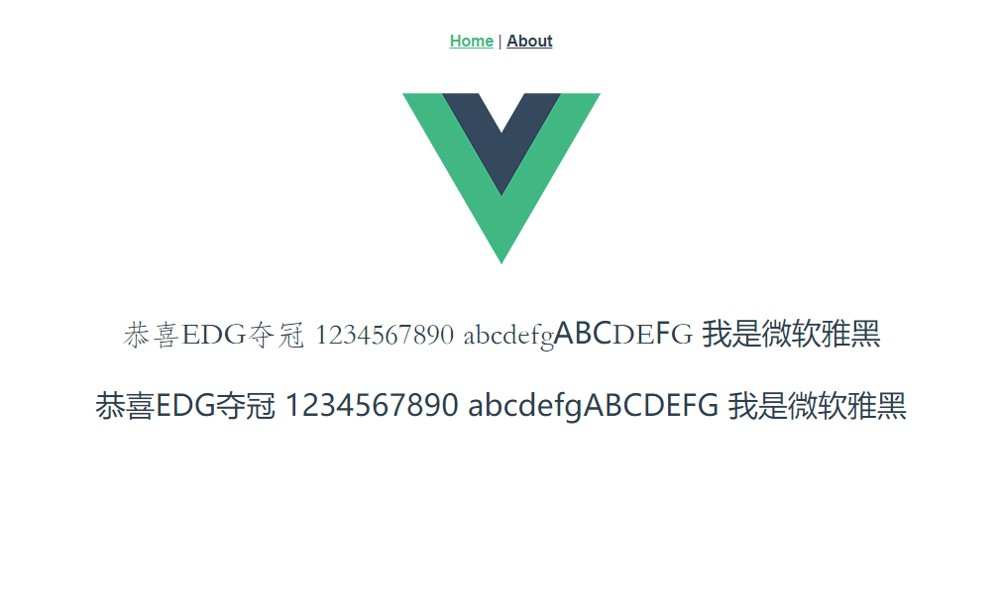

# 【字体压缩】淦，以后不用怕字体文件了

## 背景

开发项目的时候遇到一个这样的需求：要求使用思源黑体。据了解，一般字体文件体积都是蛮大的，通常 `5MB+`。谷歌了下思源黑体字体包，更是达到了 `10MB`。这么大的字体包肯定不可能直接用到项目中去，用了就是跟乌龟比速度，少不了领导的一杯茶 🤓

回归正传，直接用字体包肯定是不行的，那么就必须找个方法去 **“压缩”** 一下

## Fontmin

`Fontmin` 是一个纯 `JS` 字体子集化方案。利用 `Fontmin` 可以提取 `TTF` 字体文件中需要用到的字符，然后转换为 `TTF` 文件输出，从而实现“压缩”的效果

官网地址：[http://ecomfe.github.io/fontmin/](http://ecomfe.github.io/fontmin/)

这是目前找到的一个比较好的解决方案，接下来就开始撸一下代码测试测试吧。

## 预备工作

先随意搞一个仓库（`vue` 项目、新文件夹 `npm init` 一下都 OK，能用就行。以下是基于 `vue` 项目写的测试代码）

安装一下 `fontmin` 插件

```shell
npm install --save fontmin
```

准备个字体包，为了显示效果明显一点，这里选用了华文仿宋字体，也就 `11MB`


创建 `font.js` 并输入以下代码

```javascript
var Fontmin = require("fontmin")

var fontmin = new Fontmin()
  .src("./src/assets/font/huawenfangsong.ttf")
  .dest("./src/assets/fontmin/")
  .use(
    Fontmin.glyph({
      text: "恭喜EDG夺冠1234567890qwertyuiopasdfghjklzxcvbnm"
    })
  )

fontmin.run(function(err, files) {
  if (err) {
    throw err
  }
})
```

如果想知道为什么这样写的话，可以去看看 GitHub 文档：[fontmin](https://github.com/ecomfe/fontmin)

## 开撸

可能大家都看出来了，上面的代码执行了这么一个任务：将 `${text}` 中的文字单独生成一个字体包！

`node` 执行一下命令：

```shell
node .\font.js
```

可以看到输出路径下静静地躺着个字体文件。好家伙，才 `13KB`！再看看原来的字体包 `11MB`，这不就是我们想要的效果吗？




对比一下 `font.js` 与效果图，很明显只要是被“抽离”的文字，都显示为“华文仿宋”字体样式。显然，这就是我们想要的效果！

## 完整代码

```javascript
const fs = require("fs")
const Fontmin = require("fontmin") // 需要借助 fontmin 插件
let set = new Set()

//get all possible characters
const scanFolder = (dir, done) => {
  let results = []
  fs.readdir(dir, (err, list) => {
    if (err) {
      return done(err)
    }
    let i = 0
    ;(function iter() {
      let file = list[i++]
      if (!file) {
        return done(null, results)
      }
      file = dir + "/" + file
      fs.stat(file, (err, stat) => {
        if (stat && stat.isDirectory()) {
          scanFolder(file, (err, res) => {
            results = results.concat(res)
            iter()
          })
        } else {
          results.push(file)
          iter()
        }
      })
    })()
  })
}

//get all possible characters
const generateFinalHTML = finalString => {
  const fontmin = new Fontmin()
    .src("./src/assets/font/SourceHanSansCN-Regular.ttf") // 源字体文件路径
    .dest("./src/assets/font/fontmin/") // 压缩后文件存放路径，最终使用的是这个压缩后的文件
    .use(
      Fontmin.glyph({
        text: finalString, // 也可以直接指定需要生成的字符集
        hinting: false
      })
    )

  fontmin.run(err => {
    if (err) {
      throw err
    }
  })
}

//get all possible characters
// 指定扫描路径，注意路径不同，会导致最终扫描到的字符数不同
scanFolder("src/views", (n, results) => {
  results.forEach(file => {
    const result = fs.readFileSync(file, "utf8")
    const currentSet = new Set(result)
    // 获取到每个文件中的字符，并存储到set集中
    set = new Set([...set, ...currentSet])
  })
  generateFinalHTML(Array.from(set).join(""))
  console.log("共生成：" + Array.from(set).length + "个字符")
})
```

## 压缩效果

本次测验中实际使用字符集共 791 个，压缩前字体包大小为 10526KB，压缩后为 196KB，压缩比接近 99%

**压缩前**：

**压缩后**：

## 思考

- 只能用于静态网站，也就是指页面的内容都是在前端写死的（缺陷）
- 如果是动态网站，那么动态返回的那部分内容将不会改变字体（缺陷）
- 考虑性能代价情况下，将常用的 `3500` 或 `7000` 汉字单独打包成一个字体文件并使用，尽可能保证常用字符的正常显示（措施）
