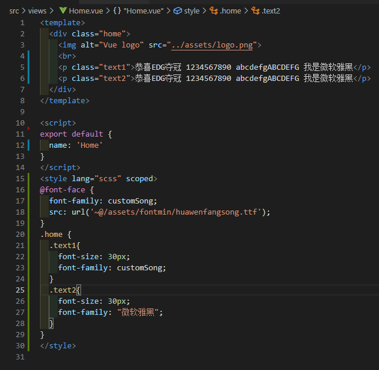
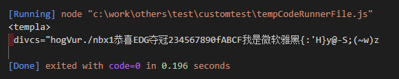

# 【字体压缩】淦，以后不用怕字体文件了

## 背景

开发项目的时候遇到一个这样的需求：要求使用思源黑体。据了解，一般字体文件体积都是蛮大的，通常 `5MB+`。谷歌了下思源黑体字体包，更是达到了 `10MB`。这么大的字体包肯定不可能直接用到项目中去，用了就是跟 🐢 比速度

回归正传，直接用字体包肯定是不行的，那能不能跟图片一样可以去 **“压缩”** 一下呢？🤔

## Fontmin

`Fontmin` 是一个纯 `JS` 字体子集化方案。利用 `Fontmin` 可以提取 `TTF` 字体文件中需要用到的字符，然后转换为 `TTF` 文件输出，从而实现“压缩”的效果

官网地址：[http://ecomfe.github.io/fontmin/](http://ecomfe.github.io/fontmin/)

这是目前找到的一个比较好的解决方案，接下来就开始撸一下代码测试测试吧。

## 预备工作

先准备一个代码仓库（`vue` 项目、新文件夹 `npm init` 一下都 OK，能用就行。以下是基于 `vue` 项目写的测试代码）

安装 `fontmin` 插件

```shell
npm install --save fontmin
```

准备一个字体包，这里为了显示效果明显一点，选用了华文仿宋字体，不大，也就 `11MB`🤢


创建 `font.js` 并输入以下代码

```javascript
var Fontmin = require("fontmin")

var fontmin = new Fontmin()
  .src("./src/assets/font/huawenfangsong.ttf")
  .dest("./src/assets/fontmin/")
  .use(
    Fontmin.glyph({
      text: "恭喜EDG夺冠1234567890qwertyuiopasdfghjklzxcvbnm"
    })
  )

fontmin.run(function(err, files) {
  if (err) {
    throw err
  }
})
```

这是 `fontmin` 文档上的用法，还有其他用法可以去看看 `GitHub` 上的文档：[fontmin](https://github.com/ecomfe/fontmin)

## 开撸

大家应该都看得出来，上面的代码执行了这么一个任务：将 `${text}` 中的文字从字体包中“抽离”出来，并单独生成一个新的字体包！

现在开始操作一下。首先用 `node` 执行一下命令：

```shell
node .\font.js
```

可以看到输出路径下静静地躺着个字体文件。好家伙，才 `13KB` 😍！再看看原来的字体包 `11MB`，整整压缩了 `99.9%` ！


再来看看页面效果，是不是也能正常显示：


对比一下 `font.js` 与效果图，很明显只要是被“抽离”的文字，都显示为“华文仿宋”字体样式。显然，这就是我们想要的效果！

## 优化

但是！这样还是不够的，实际项目中我们也不可能手动把所有文字都写出来放到 `${text}` 中去。接下来搞一下读取文件的功能，读取其中包含的所有字符。

这个时候，我们就需要借助一下 `node` 的 `fs` 模块。码一下代码，看看输出的内容。（记得要 `set` 一下 😎）

这里分享一个插件：[Code Runner](https://marketplace.visualstudio.com/items?itemName=formulahendry.code-runner&ssr=false#review-details)，可以直接运行代码片段。

```javascript
const fs = require("fs")

fs.readFile("./test.html", (err, data) => {
  if (err) {
    console.log(err)
  }
  const mySet = new Set(data.toString()) // 去重的目的
  console.log(Array.from(mySet).join(""))
})
```

测试页面如下：



读取结果如下：



搞定！

读取这一块已经完成了，但还需要再进一步优化，毕竟项目中不仅仅这么一个文件，所以我们需要增加一个“扫描”文件夹的方法

```javascript
const fs = require("fs")

const scanFolder = dir => {
  var result = []
  const dirRes = fs.readdirSync(dir) // 读取文件夹，返回一个文件（夹）list
  dirRes.forEach(list => {
    let path = dir + "/" + list
    const statRes = fs.statSync(path) // 读取文件详情，判断是否为文件夹
    if (statRes.isDirectory()) {
      result = result.concat(scanFolder(path))
    } else {
      result = result.concat(scanFile(path))
    }
  })
  const mySet = new Set(result)
  return Array.from(mySet)
}

const scanFile = path => {
  let res = fs.readFileSync(path)
  const mySet = new Set(res.toString())
  return Array.from(mySet)
}

console.log(scanFolder("./src/views").join(""))
```

运行结果这里就不展示了，各位看官可以自行操作一下。这里用的都是 `fs` 的同步方法，稍微注意下校验即可。

整个流程已经完成了，可以通过自动扫描文件生成一个字符集，然后再用 `fontmin` 的 `glyph` 方法“抽离”出来并生成新的字体文件

（Tips：还可以配置一下 `npm` 命令呦 😄）

## 完整代码

以下源码来自：<https://zhuanlan.zhihu.com/p/48318293>

```javascript
const fs = require("fs")
const Fontmin = require("fontmin") // 需要借助 fontmin 插件
let set = new Set()

//get all possible characters
const scanFolder = (dir, done) => {
  let results = []
  fs.readdir(dir, (err, list) => {
    if (err) {
      return done(err)
    }
    let i = 0
    ;(function iter() {
      let file = list[i++]
      if (!file) {
        return done(null, results)
      }
      file = dir + "/" + file
      fs.stat(file, (err, stat) => {
        if (stat && stat.isDirectory()) {
          scanFolder(file, (err, res) => {
            results = results.concat(res)
            iter()
          })
        } else {
          results.push(file)
          iter()
        }
      })
    })()
  })
}

//get all possible characters
const generateFinalHTML = finalString => {
  const fontmin = new Fontmin()
    .src("./src/assets/font/SourceHanSansCN-Regular.ttf") // 源字体文件路径
    .dest("./src/assets/font/fontmin/") // 压缩后文件存放路径，最终使用的是这个压缩后的文件
    .use(
      Fontmin.glyph({
        text: finalString, // 也可以直接指定需要生成的字符集
        hinting: false
      })
    )

  fontmin.run(err => {
    if (err) {
      throw err
    }
  })
}

//get all possible characters
// 指定扫描路径，注意路径不同，会导致最终扫描到的字符数不同
scanFolder("src/views", (n, results) => {
  results.forEach(file => {
    const result = fs.readFileSync(file, "utf8")
    const currentSet = new Set(result)
    // 获取到每个文件中的字符，并存储到set集中
    set = new Set([...set, ...currentSet])
  })
  generateFinalHTML(Array.from(set).join(""))
  console.log("共生成：" + Array.from(set).length + "个字符")
})
```

## 思考

可能已经有看官发现，这个方案只是针对本地（项目下）的文件进行扫描，对于从后端返回来的数据是没办法实现的，就比如用户名...

我认为的一个稍微好一点的解决方案，便是将常用的 `3000` 或 `7000` 汉字以及字母、数字、符号等生成一个字体文件，其余的使用降级方案

如果还不行，那就跟产品 Battle Battle

<div style="display:flex;justify-content:center"><span style="transform: rotateY(180deg)">🤺</span> &nbsp;  &nbsp;  &nbsp; <span>🤺</span></div>
