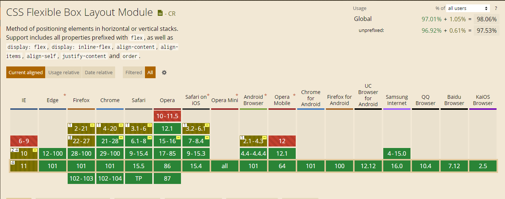
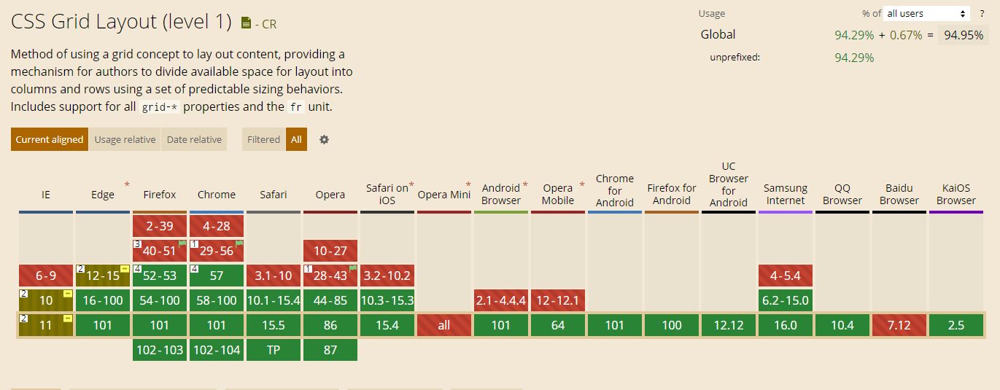

# 理解 Flex 布局与 Grid 布局及其区别

`Grid` 布局与 `Flex` 布局存在有一定的相似性，都可以指定容器内多个子项目的位置，但它们之间也存在着重大的区别

## 概念

- `Flex` 布局

`Flex` 布局又称弹性布局。在 `Flex` 布局的容器中，默认存在两根轴：水平的主轴和垂直的交叉轴。容器中的子元素默认是按照主轴的方向排列，也可通过设置 `flex-direction` 设置为垂直的交叉轴方向排列

`Flex` 布局是轴线布局，只能指定子元素在轴线上的位置，可以看做是“一维布局”

- `Grid` 布局

`Grid` 布局是最强大的 `css` 布局方案。在 `Grid` 布局的容器中，容器内部会被划分成一个个单元格，子项则是被放置在单元格内，同时也可以指定子项占用单元格的数量

`Grid` 布局为网格布局，可以看做是“二维布局”

## 兼容性

- Flex

- Grid

## 优缺点

## 适用场景

## 布局能力

## 参考文档

- <https://www.ruanyifeng.com/blog/2015/07/flex-grammar.html>
- <https://www.ruanyifeng.com/blog/2019/03/grid-layout-tutorial.html>
