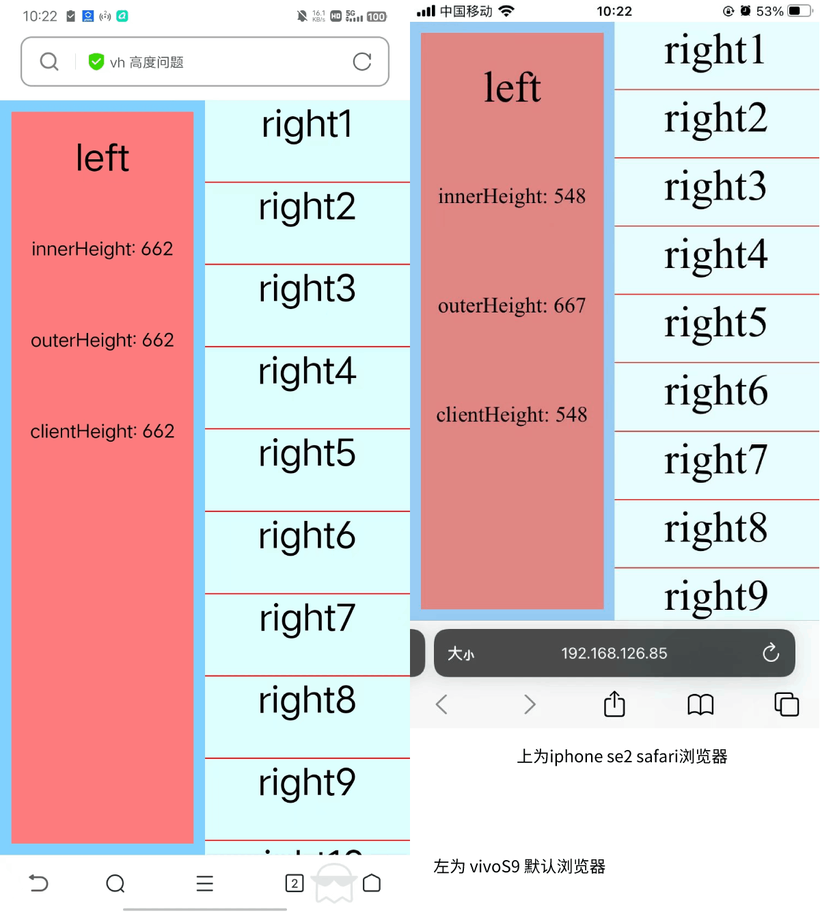

# vh 高度问题

`100vh` 通常情况下是等于视口高度，即 `window.innerHeight/document.document.body.height`

但在开发过程中遇到这么个问题，一些手机的原生浏览器以及 `Safari` 浏览器，使用 `100vh` 的实际高度大于可视区域，如下图

当时也没想着会是 `vh` 的兼容性问题，瞎整了好些时间。如上图，会发现右侧的区域有一部分会被遮盖，遮盖的高度大致为导航栏的高度

## 参考文档

- [视口](https://developer.mozilla.org/zh-CN/docs/Web/CSS/Viewport_concepts)
