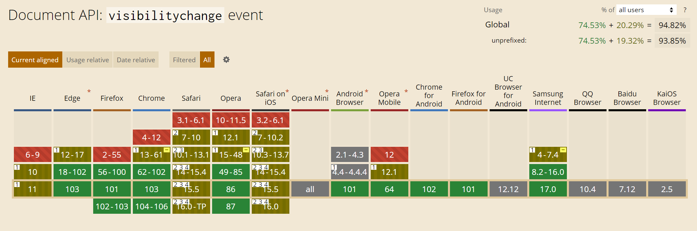

# 用户在线时长统计方案思考

## 背景

基于业务需求，需要设计一个统计用户访问某平台总时长的方案（基于 `vue` 框架），这里记录下实现过程中的一些思考

> Tips：【总时长】在本需求特指页面出现在屏幕可视区域内的情况

目前主要从这两方面入手考虑：基于用户开始和结束访问平台的时间节点计算访问时长、基于每个页面的访问时长然后再合并为总的访问时长。如果有其他更好的实现方案，也请不吝赐教

## 基于开始和结束访问的时间节点统计

本方案主要是在 `App.vue` 中利用 `created` 和 `beforeDestory` 两个钩子函数，当触发 `created` 钩子时，记录开始访问的时间戳；当触发 `beforeDestory` 钩子时记录结束访问的时间戳，计算出此次访问的总时长，然后再通过接口发送给后端记录

方案其实蛮简单的，不过简单的代价就是会存在比较多的问题

- 该方案无法精确地记录到用户的结束访问时间

  用户访问结束的时间除了正常的关闭标签页、关闭浏览器，还存在直接杀掉浏览器进程、关闭电脑等多种情况，如果用户在较长时间内没有触发平台的刷新或关闭，那么这段时间的访问时长将会丢失。如果使用 unload、beforeUnload 事件，也会有较多的[兼容性](https://developer.mozilla.org/zh-CN/docs/Web/API/Navigator/sendBeacon#%E9%81%BF%E5%85%8D%E4%BD%BF%E7%94%A8_unload_%E5%92%8C_beforeunload)的问题

- 多标签页同时打开平台时，访问时间重合的问题

  当平台触发新标签页打开或手动新开标签页访问平台时，访问的开始时间与结束时间便会产生重合，这部分的重合会导致访问时长的大大增长，甚至出现某天的访问时长超过 `24` 小时

- 页面切后台时无法判断

  当切换到其他标签页或其他软件时，平台处于后台运行状态，这时候的访问时长不应该被计算到访问总时长中去，即不承认“**挂机**”行为

## 基于每个页面的访问时长统计

本方案主要是借助路由的钩子 `beforeEach` 实现。当页面跳转时，`beforeEach` 钩子会记录来源地址与去往地址，也就相当于获取到来源地址的访问结束时间 `endTime` 与去往地址的开始访问时间 `endTime`

虽然同样是比较简单的方案，但从准确性上来说有了一定的提升：

- 降低了异常关闭页面带来的访问时长误差

  相较于第一种方案，已经将误差缩小到最后一个访问页面

- 更细粒度地统计访问时长

  可以更直观的看到用户在每个页面的停留时长，并且可以根据访问时长的变化分析用户对功能调整的 “**满意程度/接受程度**”

**但** 同样也存在问题：

- 对于方案一中的缺陷仍未解决

- 接口请求较为频繁

  每个页面的跳转与刷新都会触发一次埋点，如果是使用 `ajax` 的方式提交，那么每跳转一次页面就提交一次 `ajax` 请求

我们发现，两种方案其实都无法处理多标签页、切后台的情况，因此我们需要借助其他的 “**能力**” 来实现

## visibilitychange 事件

通过页面的可见状态，可以认定为此时平台正在“**被使用**”；当页面状态为隐藏时，可以认定为此时平台已退出或正在挂机。

当页面的可见性发生变更时，会触发 `visibilitychange` 事件，再利用 `document.hidden` 属性判断当前页面是处于可见还是隐藏状态，我们也就可以轻易的在切换过程中记录到可见状态下持续的时长，而这就是我们需要的真正的访问时长

**兼容方面**：



[can i use](https://caniuse.com/?search=visibilitychange) 网站上检测的效果，`visibilitychange` 属性的覆盖率都有 `95%` 左右（`Safari` 浏览器为部分兼容，跟用法有关）基本覆盖主流浏览器。在编码实现前参考了网上的一些代码，增加了浏览器前缀。具体如下：

```javascript
document.addEventListener("visibilitychange", () => {
  const hiddenProperty =
    "hidden" in document
      ? "hidden"
      : "webkitHidden" in document
      ? "webkitHidden"
      : "mozHidden" in document
      ? "mozHidden"
      : null
  if (document[hiddenProperty]) {
    // 可见情况下 xxx
  } else {
    // 隐藏情况下 xxx
  }
})
```

此外，触发页面隐藏的情况有很多种如：`alt+tab` 切换、点击`-`缩小浏览器、`win+D` 返回桌面、`alt+F4`关闭程序等，**以当前最新版本的浏览器进行测试**，罗列出 `visibilitychange` 可能被触发的情况，兼容如下：

| 浏览器关闭方式 | 鼠标点击切换 | alt+tab 切换 | 点击-缩小 | win+D 返回桌面 | × 按钮关闭 | alt+F4 关闭程序 | 刷新 |
| -------------- | ------------ | ------------ | --------- | -------------- | ---------- | --------------- | ---- |
| Chrome         | √            | √            | √         | √              | √          | √               | √    |
| 火狐           | √            | ×            | √         | √              | √          | √               | √    |
| Edge           | √            | √            | √         | √              | √          | √               | √    |
| Opera          | √            | √            | √         | √              | √          | √               | √    |
| 360            | √            | ×            | √         | √              | √          | √               | √    |

经过测试，发现 `alt+tab` 在火狐浏览器和 `360` 系浏览器下都无法触发 `visibilitychange` 事件，而其余的情况都会触发 `visibilitychange` 事件，同样也无法通过监听键盘的 `alt+tab` 事件来获取可见状态的变化。这种情况下就只能根据业务需求来调整实现方案，无法做到完全兼容（`alt+tab` 使用率较低，且如果是利用路由守卫方案，可以通过校验单一页面访问时长，将异常的访问时长剔除，以此来降低误差情况，这也算是一个不完全的解决方案吧）

至此，可以发现方案一中存在的问题几乎都得到了解决；而方案二中并发量的问题，思考一下其实我们可以将每个页面的访问时长缓存起来（`localstorage`）然后在触发 `visibilitychange` 事件后统一提交埋点数据，这样也可以一定程度缓解并发的压力

接下来考虑的是如何提交埋点的问题

## 埋点提交

- `sendBeacon`

  埋点提交通常会使用 `ajax`，但需要考虑到一点：当页面关闭时，相当于完成了一个访问周期，这时需要将本地的访问时长提交到后端。如果是通过 `ajax` 提交，在页面关闭的同时，`ajax` 的请求也会被中断，可以考虑使用 [sendBeacon](https://developer.mozilla.org/zh-CN/docs/Web/API/Navigator/sendBeacon)即便浏览器关闭也可以正常将数据提交到后端

- `1*1` 空白 `gif` 图

  空白 `gif` 图提交埋点也是一个比较好的方案，但对于关闭浏览器是否会中断请求的问题，参考网上的说法是[部分兼容](https://github.com/Advanced-Frontend/Daily-Interview-Question/issues/87#issuecomment-516857900)（**没有实测过**）具体的优势可以查看 [Github 文档](https://github.com/Advanced-Frontend/Daily-Interview-Question/issues/87)

- `websocket`

  如果埋点提交较频繁且埋点数量较多时，可以考虑使用 [websocket](https://www.ruanyifeng.com/blog/2017/05/websocket.html)

## 结论

总的来说，如果需求侧不需要分析每个页面的访问时长，那么方案一会更适合一些；而方案二的优势在于埋点数据更加详细，缺陷也就是并发的问题（ `localstorage` 缓存或 `websocket` 可以一定程度解决）

以上两种方案都会存在一些误差，不能够准确地统计真正的在线时长，所以，我们能做的也只是尽可能的缩小误差。

## 参考文档

- [unload、beforeUnload 兼容性问题](https://developer.mozilla.org/zh-CN/docs/Web/API/Navigator/sendBeacon#%E9%81%BF%E5%85%8D%E4%BD%BF%E7%94%A8_unload_%E5%92%8C_beforeunload)
- [can i use](https://caniuse.com/?search=visibilitychange)
- [sendBeacon](https://developer.mozilla.org/zh-CN/docs/Web/API/Navigator/sendBeacon)
- [空白 gif 图提交埋点](https://github.com/Advanced-Frontend/Daily-Interview-Question/issues/87)
- [websocket](https://www.ruanyifeng.com/blog/2017/05/websocket.html)

## 写在最后

如果对以上内容有意见或建议，欢迎指教

我是枸哥，可以叫我杞爷
