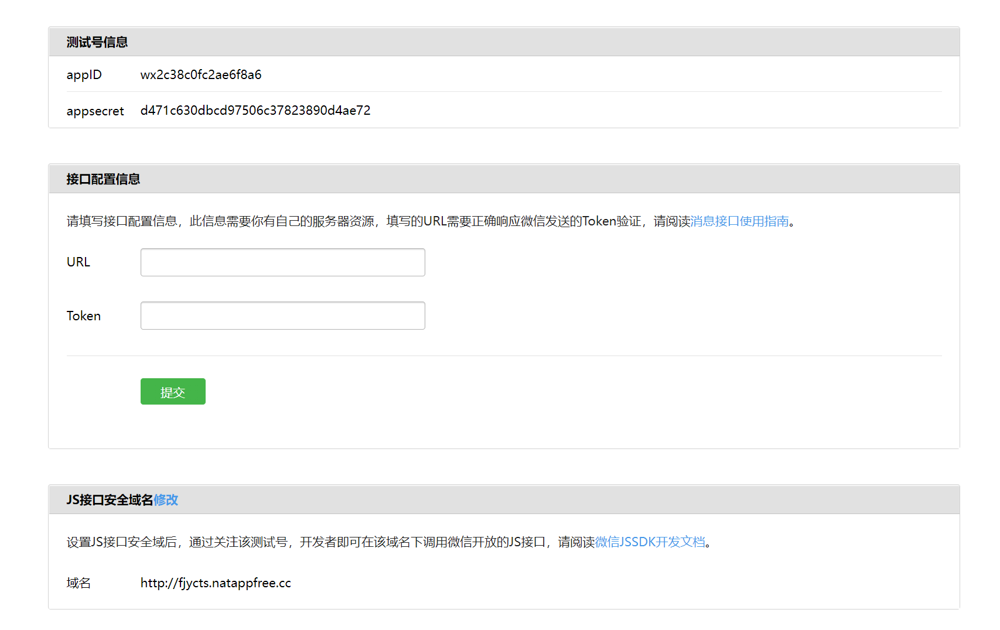
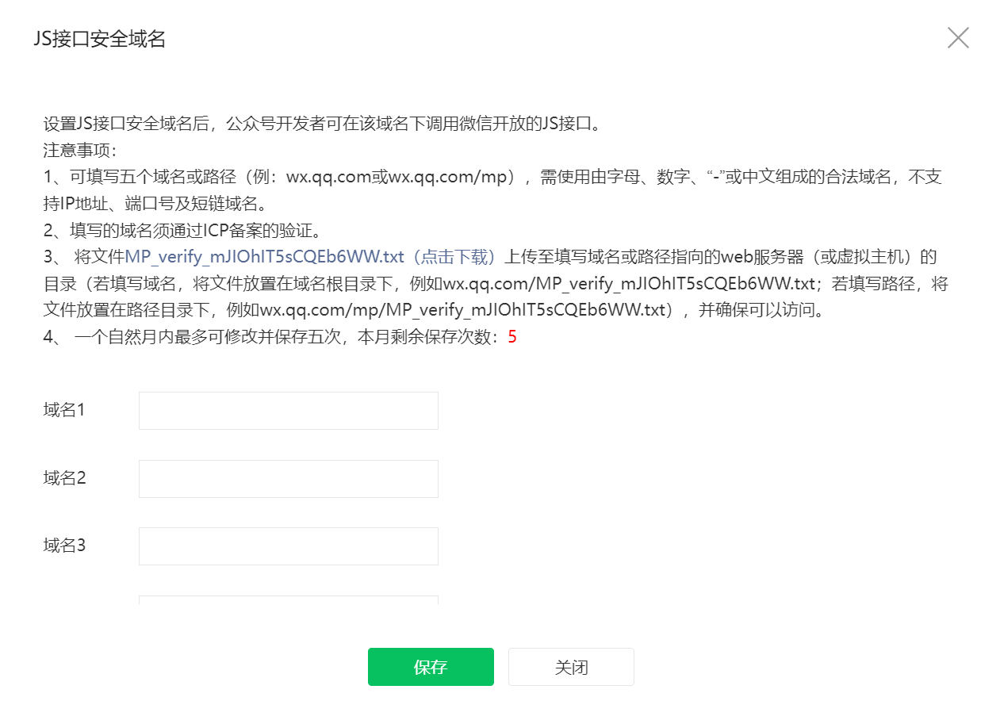

# vue3 项目下使用微信 JS-SDK

`H5` 页面中如果需要使用到微信的功能如：微信分享、扫一扫、卡包等微信特有的能力，那么就需要用到微信 `JS-SDK`

由于业务需求，刚好用到了这一块，就稍微总结分享一下 `vue3 + ts + vite` 项目中（_本地测试环境_）使用微信 `JS-SDK` 的流程，以及一些需要注意的点

## 前期准备

- 公众号：本地测试环境，会用到 [测试号](https://mp.weixin.qq.com/debug/cgi-bin/sandboxinfo?action=showinfo&t=sandbox/index)；部分功能需要用到实名认证，最好提前认证
- `AppID`、`AppSecret`
- 服务器：本地测试暂时不需要；正式环境需要用到
- 微信开发者工具：用于调试项目

## 公众号配置

由于是本地测试环境，暂时使用官方提供的测试号来测试。`AppID`、`AppSecret` 都可以直接用测试号的信息。具体如下图：

官方文档中有说明，需要设置 `JS` 接口安全域名后，才能在该域名下调用微信开放的 `JS` 接口。这里我们就手动配置一下输入项目地址/穿透地址（TODO: 本地测试好像不用设也可以获取到 `jsapi_ticket`？但最终好像鉴权不通过，得继续研究一下问题）

正式环境下需要在 `公众号 > 设置与开发 > 公众号设置 > 功能设置` 下点击 `JS` 接口安全域名添加，此外还需要在服务器的根路径下添加 `MP_verify_mJIOhIT5sCQEb6WW.txt` 文件，如下图所示：

