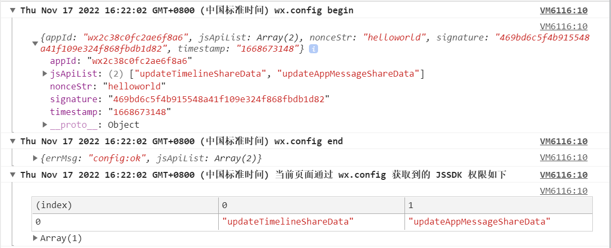

# 微信 JS-SDK 实现自定义分享功能

`H5` 页面中如果需要使用到微信的功能如：微信分享、扫一扫、卡包等微信特有的能力，那么就需要用到微信 `JS-SDK`

由于业务需求，刚好用到了这一块，就稍微总结分享一下自己在 `vue3` 项目中（_本地测试环境_）使用微信 `JS-SDK` 的流程，以及一些需要注意的点

## 前期准备

- 公众号：本地测试环境，暂时用 [测试号](https://mp.weixin.qq.com/debug/cgi-bin/sandboxinfo?action=showinfo&t=sandbox/index) 代替；部分功能需要用到实名认证，正式环境最好提前完成公众号的实名认证
- `AppID`、`AppSecret`
- 公众号配置 JS 安全域名
- 微信开发者工具：可以查看授权信息以及调试项目

## 公众号配置

开发环境下可以直接拿官方提供的 [测试号](https://mp.weixin.qq.com/debug/cgi-bin/sandboxinfo?action=showinfo&t=sandbox/index) 来测试。具体如下图：


然后我们配置一下 `JS` 接口安全域名，如果是用的测试号，那么这里的地址也可以直接使用 `ip`。需要注意，这里的链接不能带 `http://` （公众号上添加路径如下： `公众号 > 设置与开发 > 公众号设置 > 功能设置`）

## 获取 signature

- 第一步先获取 `access_token`

直接在浏览器地址栏输入：`https://api.weixin.qq.com/cgi-bin/token?grant_type=client_credential&appid=APPID&secret=APPSECRET` 即可获取到 `access_token`。其中 `appid` 和 `appsecret` 为目标公众号的信息，目前为测试号信息

注意 `access_token` 有效期为 `7200s`，需要缓存起来，过期后再重新获取，避免达到获取次数上限

- 第二步获取 `jsapi_ticket`

再次在浏览器地址栏输入 `https://api.weixin.qq.com/cgi-bin/ticket/getticket?access_token=ACCESS_TOKEN&type=jsapi`，其中 `ACCESS_TOKEN` 需要替换为第一步中获取的 `access_token`

- 第三步获取 `signature`

打开微信提供的签名校验工具：`http://mp.weixin.qq.com/debug/cgi-bin/sandbox?t=jsapisign`，分别输入对应的内容。具体如下图：


点击即可生成 signature 签名。这里需要注意 `timestamp` 的单位是 `秒` （即 `10` 位）

## JSAPI 授权

获取到签名后就比较简单了，直接贴代码，将对应字段给填上即可。[jsApiList](https://developers.weixin.qq.com/doc/offiaccount/OA_Web_Apps/JS-SDK.html#63) 为待授权的 JS 接口列表，这里参考填上需要授权的接口，

```javascript
wx.config({
  debug: true, // 开启调试模式,调用的所有 api 的返回值会在客户端 alert 出来，若要查看传入的参数，可以在 pc 端打开，参数信息会通过 log 打出，仅在 pc 端时才会打印。
  appId, // 必填，公众号的唯一标识
  timestamp, // 必填，生成签名的时间戳
  nonceStr, // 必填，生成签名的随机串
  signature, // 必填，签名
  jsApiList: ["updateTimelineShareData", "updateAppMessageShareData"] // 必填，需要使用的 JS 接口列表
})
```

这样就完成了微信授权流程，接下来就是在 `wx.ready` 中初始化分享配置

```javascript
wx.ready(function() {
  //需在用户可能点击分享按钮前就先调用
  wx.updateAppMessageShareData({
    title: "凭你的智慧，我唬得了你吗？", // 分享标题
    desc: "我们是受过严格训练的，无论多好笑都不会笑，除非忍不住", // 分享描述
    link, // 分享链接，该链接域名或路径必须与当前页面对应的公众号 JS 安全域名一致
    imgUrl: shareIcon, // 分享图标
    success: function() {
      // 设置成功
    }
  })
  wx.updateTimelineShareData({
    title: "凭你的智慧，我唬得了你吗？", // 分享标题
    link, // 分享链接，该链接域名或路径必须与当前页面对应的公众号 JS 安全域名一致
    imgUrl: shareIcon, // 分享图标
    success: function() {
      // 设置成功
    }
  })
})
```

## 可能会遇到的情况

- **授权失败**

按照上面的流程，如果授权失败可复查一下：

1. 是否正确配置 `JS` 安全域名
2. `timestamp` 是否正确（`10` 位）
3. 生成签名的 `url` 是否正确配置
4. `jsApiList` 是否已配置

授权成功后，控制台可查看到如下结果：



- **分享出来的是链接**

如果在微信开发者工具显示授权成功，但是在手机上分享出去却是链接的话，不用怀疑，是[微信的问题](https://developers.weixin.qq.com/community/develop/doc/0006a2e2418ef0a371893e19d50809?highLine=H5%2520%25E5%2588%2586%25E4%25BA%25AB%25E5%2588%25B0%25E6%259C%258B%25E5%258F%258B%25E5%259C%2588)

目前仅可以通过：`公众号内打开链接`、`二维码扫码打开`、`微信收藏内打开`、`以及通过以上途径分享出来的链接`（正常的分享入口）才能正常使用分享接口

## 写在最后

以上是本次分享的所有内容

如果对以上内容有问题，欢迎指教

我是枸哥，可以叫我杞爷

## 参考文档

- [签名算法](https://developers.weixin.qq.com/doc/offiaccount/OA_Web_Apps/JS-SDK.html#62)
- [签名校验工具](http://mp.weixin.qq.com/debug/cgi-bin/sandbox?t=jsapisign)
