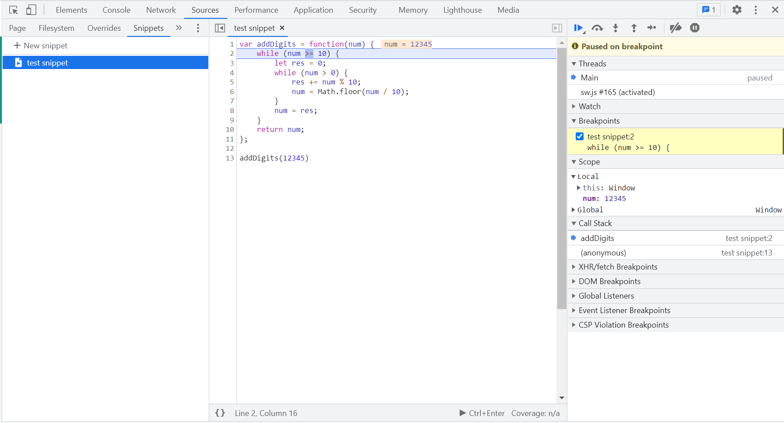
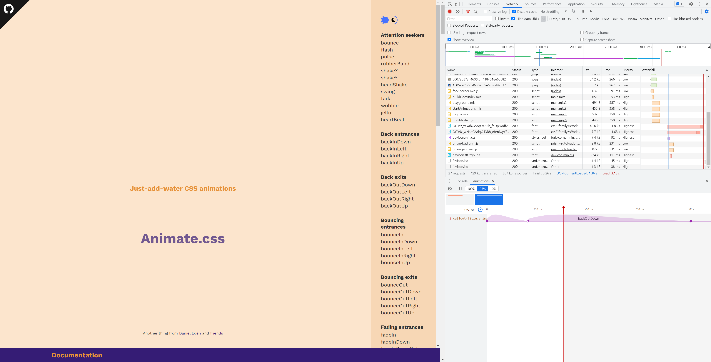
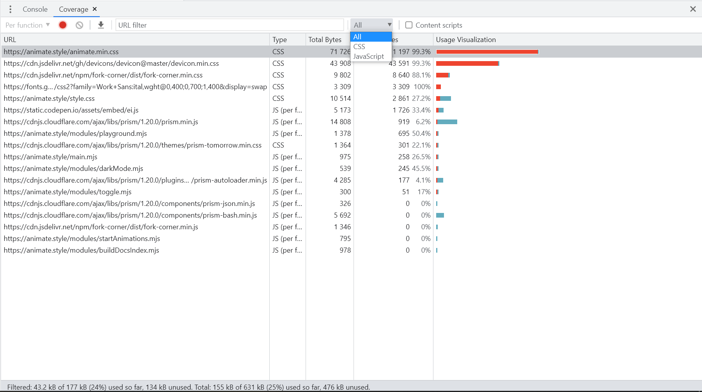
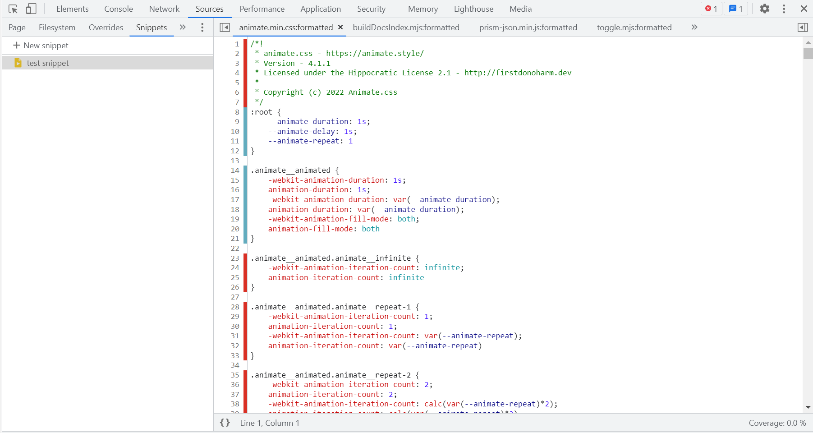
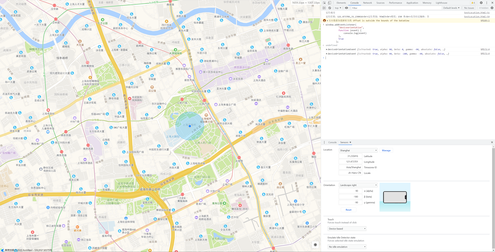
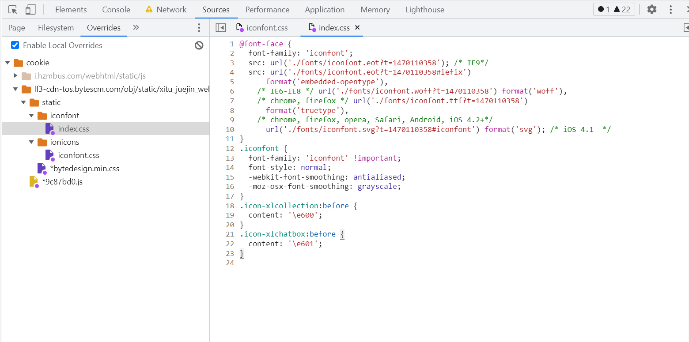
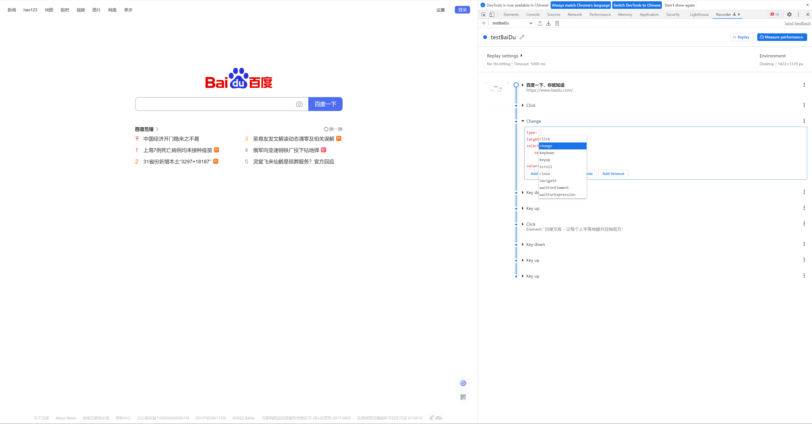
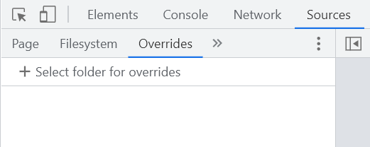
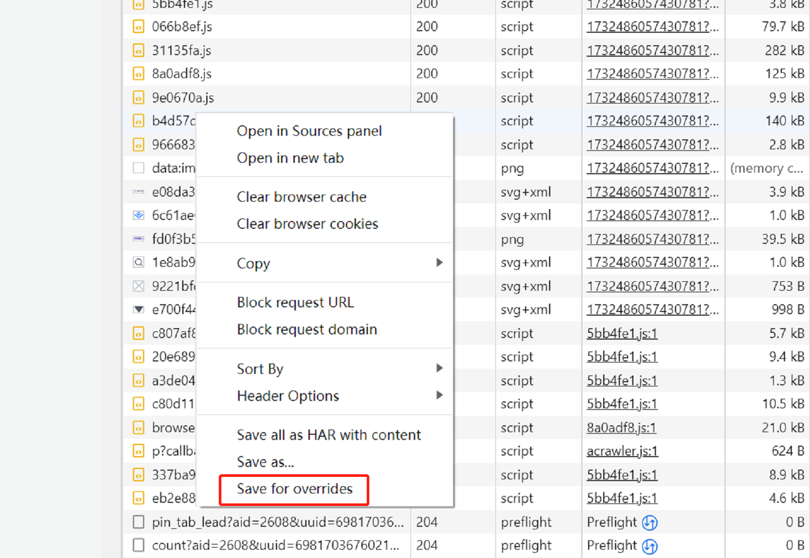
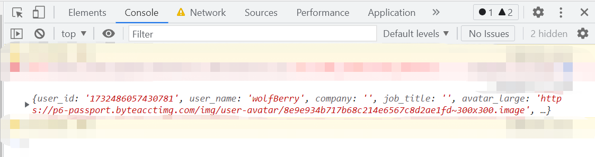

# 挖掘谷歌浏览器小工具

作为 `前端er`，可能 `90%` 以上的工作都是围绕着浏览器展开的，是我们工作的重要媒介。了解多点浏览器可以帮助我们更快更好地完成工作

下面分享一些谷歌浏览器个人觉得比较好用的工具

## snippet 代码片段

代码片段编辑及保存工具，可通过开发者工具 `Source > Snippets` 打开

使用场景：

- 编写并运行代码片段（`Code Runner` 插件也很优秀）
- 支持代码 `debug`（常用 `console` 测代码的福音）
- 作为备忘录记录常用代码，关闭浏览器不删除代码片段（同火狐 `Scratchpad`）
- ...

## Animations 动画窗格

动画分析工具，可以通过 `控制台 > More Tools > animations` 打开动画窗格

功能：

- 获取页面内所有的动画
- 可设置播放速度（`100%`、`25%`、`10%` 可选三个级别）
- 可指定某个动画播放
- 动画节点可拖拽更改播放时间，更改后可直接预览

使用场景：

- 更好地模仿动画效果（甲方爸爸：我要它像\*\*一样动起来）
- 更好地调试自己写的动画
- ...

## Coverage 代码使用率

CSS、JS 使用情况分析工具，可以通过 `控制台 > More Tools > Coverage` 打开分析工具

功能：

- 记录当前打开页面请求的所有 `js`、`css` 资源文件的使用情况
- 区分文件内被使用的代码与未被使用的代码（红色标记被使用，蓝色标记未被使用）

使用场景：

- 可以作为性能优化的一种手段，针对零使用率或低使用率的可以考虑懒加载
- 分析第三方库的使用情况（如：分析 `element-ui` 的使用情况考虑按需引入还是全局引入）
- ...

注：`Coverage` 只能作为一种参考手段，并不一定完全准确。如：使用媒体查询的情况下，符合当前条件的部分 `css` 标红，而非当前条件的部分 `css` 则标蓝

## sensors 传感器及地理位置

谷歌提供的设备传感器测试工具，可以通过 `控制台 > More Tools > Sensors` 打开传感器工具

功能：

- 重写用户所在的地理位置（预设或自定义调整）
- 调整移动端设备的设备方向（预设或自定义调整）
- 强制替换触摸而不是点击
- 模拟空闲检测器状态（如：缺少与键盘、鼠标、屏幕的交互、屏幕保护程序的激活、屏幕锁定或移动到另一个屏幕等情况）

使用场景：

- 可以用来模拟所在的地理位置
- 可以用来模拟设备方向
- 可以用来模拟设备当前活动/空闲状态

## Override 修改代码

这是个很强大且用途蛮多的一个工具，可以通过 `Sources > Overrides` 打开面板

功能：

- 可以将站内的 `css、js` 文件等缓存下来并修改，刷新页面后加载【`该缓存文件`】！

使用场景：

- 既然都可以改源码还可以运行，可以干什么事情 `DDDD` 😎
- ...

文末会简单演示一下，可以随意找个网站，很快可以上手

## Recorder

这是一个记录用户交互的一个工具，打开开发者工具即可看到。`Recorder` 工具有版本限制，不过可以下一个 `Beta` 版本的 `Chrome`（可同时安装）即可体验

功能：

- 记录某一段时间内用户的交互记录，如点击事件、键盘事件等（但不包括鼠标滑动轨迹）
- 播放记录的用户操作，并且可以针对各个交互节点进行修改（修改事件、`DOM` 节点、增加延迟等）

使用场景：

- 适用于临时性重复工作的场景如：复现某些 `bug`、同一业务流程不同设备下的表现等

## 【附录】

下面简单整一下某个网站个人主页的“我的信息”吧

- 打开 `Overrides` 面板，指定缓存文件夹。选择后浏览器会弹出一个请求访问权限的确认框，点击允许即可使用功能

- 打开 `Network` 面板，找到获取个人信息的接口：`**/user_api/v1/user/get?aid=**`，通过 `Network` 面板下的搜索工具，可以查到接口所在文件。然后 `右键 -> Save for overrides`

- 接下来就可以继续在 `Sources` 面板对代码文件进行魔改了
- 修改、保存、刷新页面，想要的数据就出来了

## 写在最后

以上是本次浏览器工具分享的所有内容

目的是分享，深入可另行谷歌

如果有新的内容，会继续更新在本文档，欢迎关注

如果对以上内容有问题，欢迎指教

我是枸哥，可以叫我杞爷
