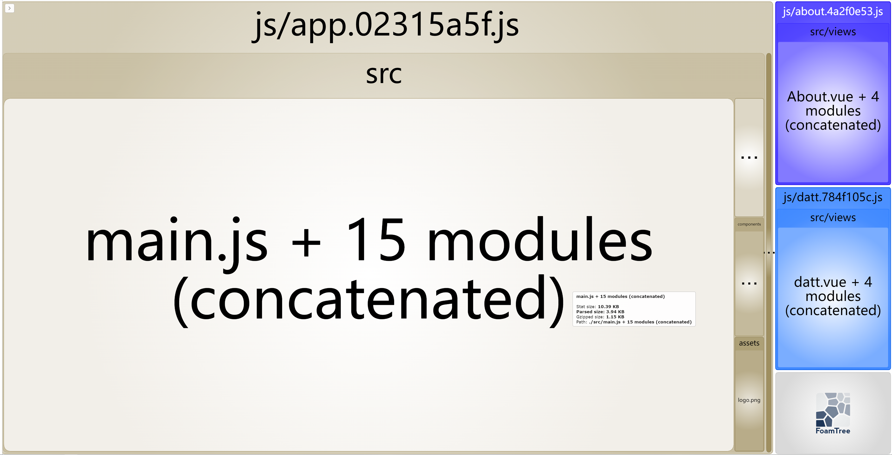

# 【实用篇】splitChunks 与 import 方式的化学反应

## 前言

`webpack` 拆包分包是性能优化中的常用手段之一，在 `webpack4` 之前是用 `CommonsChunkPlugin` 来做这一优化，但在 `webpack4` 之后被 `SplitChunksPlugin` 取而代之。

`SplitChunksPlugin` 开箱即用，在 `webpack` 官网有一套默认的配置，但对于其默认的配置并不一定适合我们的业务：

- 新的 `chunk` 可以被共享，或者模块来自于 `node_modules` 文件夹
- 新的 `chunk` 体积大于 `20kb`（在进行 `min+gz` 之前的体积）
- 当按需加载 chunks 时，并行请求的最大数量小于或等于 `30`
- 当加载初始化页面时，并发请求的最大数量小于或等于 `30`

事实上，配置的好坏还跟开发者本身的使用方式有关系：随意一点的开发者喜欢全局引入，而强迫一点的开发者又偏爱动态 `import`。相同的一份配置不同的引入方式，也会导致打包结果的不同。

以下内容为实验步骤，主要研究 `minSize` 和 `minChunks` 与引入方式之间的化（`ài`）学（`hèn`）反（`qíng`）应（`chóu`）。

## 准备

### 环境说明

当前使用的环境、版本如下，测试项目为空 `vue2` 项目，且是**单入口**项目

- `window x64`
- `node` 版本：`12.12.0`
- `webpack`：`4.46.0`
- `vue`：`2.6.14`

### vue.config.js 配置说明

`vue.config.js` 文件配置如下，需要提前安装 `webpack-bundle-analyzer` 依赖。

```javascript
// vue.config.js
const { BundleAnalyzerPlugin } = require("webpack-bundle-analyzer")
module.exports = () => ({
  configureWebpack: config => {
    if (process.env.ENV === "analyze") {
      // 手动配置npm命令
      config.plugins.push(
        // 使用打包分析插件
        new BundleAnalyzerPlugin({
          analyzerHost: "localhost",
          analyzerPort: "8182"
        })
      )
    }
  },
  chainWebpack: config => {
    config.when(process.env.NODE_ENV === "production", config => {
      // 拆包，减少首次加载vendor文件的大小，减少首屏事件
      config.optimization.splitChunks({
        // 相关配置选项可看官网：https://v4.webpack.docschina.org/plugins/split-chunks-plugin/
        //这里的配置针对所有缓存组
        chunks: "all", // 针对所有代码块
        minSize: 10000, // 最小提取chunk大小
        maxSize: 0,
        minChunks: 1, // 最小引用次数
        maxAsyncRequests: 5,
        maxInitialRequests: 3,
        automaticNameDelimiter: "~",
        automaticNameMaxLength: 30,
        name: true,
        cacheGroups: {
          // 将体积较大的包单独分离出来，减少vendor的体积，加快首屏速度
          vendors: {
            name: "chunk-vendors", // enforce默认为false下不能直接设置name值，否则打包会失败
            test: /[\\/]node_modules[\\/]/,
            priority: -10, // 表示缓存的优先级；
            enforce: true
          }
        }
      })
    })
  }
})
```

这里配置了 `npm` 命令，方便执行分析

```json
// package.json
"scripts": {
  "analyze": "set ENV=analyze&&vue-cli-service build"
}
```

### 文件结构

文件结构主要如下，用于测试的文件为 `test.vue`，大小约等于 `14KB`，这就是上配置项 `minSize` 值为 `10000` 的原因（内容不重要，“大”就行 😃）

```text
|-- .vscode 覆盖vscode的配置
|-- src
|   |-- components 全局组件/第三方组件
|       |-- Helloworld.vue
|       |-- test.vue 全局/局部引入的组件，size≈14KB
|   |-- views
|       |-- Home 页面1
|       |-- About 页面2
|       |-- Datt 页面3
|   |-- app.vue 入口文件
|-- vue.config.js vue 打包配置文件
```

### 路由结构

注意一下路由，需要为文件指定 `chunkName`

```javascript
const routes = [
  {
    path: "/",
    name: "Home",
    component: Home
  },
  {
    path: "/about",
    name: "About",
    component: () => import(/* webpackChunkName: "about" */ "../views/About.vue")
  },
  {
    path: "/datt",
    name: "datt",
    component: () => import(/* webpackChunkName: "datt" */ "../views/datt.vue")
  }
]
```

若不想手动，，，，，<https://github.com/Real102/vuesplitchunk.git>

## 开淦吧

### 场景一：全局引入

首先来测试一下全局引入的情况，我猜很多 `GYM` 会经常干这种事，毕竟方便快捷哈哈哈。

配置项稍微再同步一下，其他项不动。注意 `mixSize` 大小要小于 `test.vue` 的体积（且要大于 `helloworld.vue` 体积）

```javascript
config.optimization.splitChunks({
  minSize: 10000,
  minChunks: 1
})
```

跑一下分析命令：`npm run analyze`，会自动打开 `http://localhost:8182/` 页面，如下：


为了看起来舒服一些，已经把 `chunk-vendor` 隐藏了（后面同样隐藏）。接下来保留分析的页面，并且暂时取消全局引入 `test.vue`，重新运行：



对比以上两张图，全局引入下的 `app.js` 跟未引入下情况下，体积差约等于 `test.vue` 的体积（实际体积差为 `12.79KB`，小于 `test.vue` 的体积<sup style="color: red"> \*</sup>，具体什么原因可以继续往下看）那么可以推测出，`test.vue` 其实是被打包到 `app.js` 中了（并未单独生成一个 `chunk`）。

`GYM` 如果有兴趣的话可以测试一下，当不满足 `minSize` 、 `minChunks` 或都不满足时，`test.vue` 打包路径的问题。不出意外应该都是被打包到了 `app.js`（不满足条件当然不会拆包啦，都会被打包到 `app.js` 中去）

### 场景二：非首页的局部引入

如题所述，取消 `test.vue` 的全局引入，单独在 `about.vue`、`datt.vue` 两个文件中引入

首先改一下配置条件，使 `test.vue` 仅满足 `minSize` 条件。运行分析命令：

```javascript
config.optimization.splitChunks({
  minSize: 10000,
  minChunks: 3 // 当前不满足3次引用
})
```


先不着急分析，我们再改一下配置条件，使 `test.vue` 仅满足 `minChunks` 条件。运行分析命令：

```javascript
config.optimization.splitChunks({
  minSize: 30000,
  minChunks: 1 // 当前不满足3次引用
})
```


现在可以对比一下以上两张图，发现有以下两点问题：

1. 仅满足 `minSize` 条件时，`test.vue` 被拆包了
2. 仅满足 `minChunks` 条件时，`test.vue` 被分别打包到 `about.vue` 和 `datt.vue`
3. `test.vue` 的体积为 `12.8KB`

首先看一下第二个问题，当不满足拆包条件时，`webpack` 会将被引用到的组件合并到源文件所属的 `chunk` 中去，这个应该没啥毛病

然后是第三个问题，`test.vue` 的体积是 `12.79KB`，对比场景一中的体积差，其实发现几乎是一样的（`12.79KB` 与 `12.8KB`），至于为什么不是 `14KB`，猜测应该是经过了 `webpack/terserPlugin` 压缩处理导致

最后来看看第一个问题吧，我重新又测试了满足 `minSize` 条件下 `minChunks` 值为 `13` 甚至 `30` 的情况，发现 `test.vue` 依旧会被拆包。可能很多 `GYM` 都以为**需要同时满足两个条件才会拆包**，包括我也是**深信不疑**（直到做了这个实验...）

**敲黑板**！！！**敲黑板**！！！**敲黑板**！！！

其实出现上面情况，还跟 `chunks` 有关。`chunks` 可取 `initial`、`async`、`all` 三个值，分别代表拆包的对象：`首页所需的代码块`，`按需引入的代码块`，`所有代码块`。这里就不写过程了，感兴趣的话可以自己测一遍，控制好 `minSize` 和 `minChunks` 两个变量即可。以下是我自己测试出来的结论：

1. `chunks = initial`：仅针对首页所需的代码进行切割。`node_modules` 会被打包到 `chunk-vendor.js`（如有配置），其他所需模块都会被打包到 `app.js`，并且非首页所需的代码，**即便满足条件也不会被抽取出来**
1. `chunks = async`：仅针对按需加载的代码进行切割。`node_modules` 及其他首页需要用到的代码会被打包到 `app.js`（即使有配置），而非首页需要的其他代码，**只要满足 `minSize` 且引用次数大于 1 就会被抽取出来**
1. `chunks = all`：针对所有代码进行切割。首先会按照 `cacheGroups` 进行抽取，首页需要用到的代码会被打包到 `app.js`，非首页需要的其他代码，**只要满足 `minSize` 且引用次数大于 1 就会被抽取出来**

### 场景三：包含首页的局部引入

如题所述，在首页引入 `test.vue` 和 `about.vue` 两个文件中引入。

同样的，先改一下配置参数，使同时满足两个条件，并且将 `chunks` 恢复为 `all`：

```javascript
config.optimization.splitChunks({
  chunks: "all", // 恢复为all
  minSize: 10000,
  minChunks: 1
})
```


从上图可以看出，`test.vue` 被打包到 `app.js` 中去，而非提取出来。由此可见，条件不满足的情况下更不可能抽取出来。

## 淦完了，总结一个

到这里，`minSize`、`minChunks` 与 `import` 方式之间会产生什么化学反应应该都比较明朗了。

一般情况下，我们更多的是针对所有代码块进行切割，对于 `async` 会缺少对首页的处理，`initial` 会缺少对其他非首页模块的处理，`GYM` 可以去尝试一下

**以下的结论也主要是针对 `chunks = all` 的结果**：

1. 全局引入的代码块，都将被并入 `app.js` 下，因此需要慎重考虑哪些需要全局引入，哪些需要局部引入（区分首页是否需要引入）
2. 首页需要引入的代码块，对于局部引入还是全局引入没有区别，都会被合并到 `app.js` 中去
3. 按需引入的代码块，可以从全局的角度去考虑 `minSize` 和 `minChunks` 的值（过多的抽取公共代码会导致请求的增加，相反地虽然可以减少请求，但是会增加 `chunk` 的体积，因此综合考虑性能与代价是一件很必要的事）

## 写在最后

以上是所有实验内容，有兴趣可以对 `async`、`initial`、多入口项目等淦一遍，可能会有惊喜呦 😎~

测试代码相对比较简单，建议还是根据实际项目去做优化。思想掌握了，实现就不难了

如果对以上内容有问题，欢迎指教

我是枸哥，可以叫我杞爷
