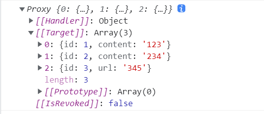
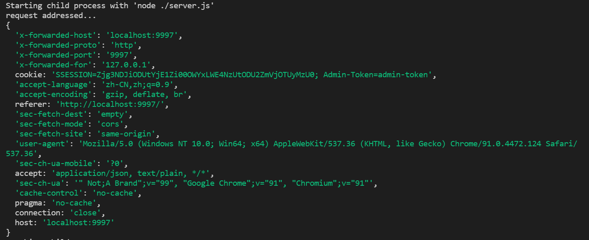
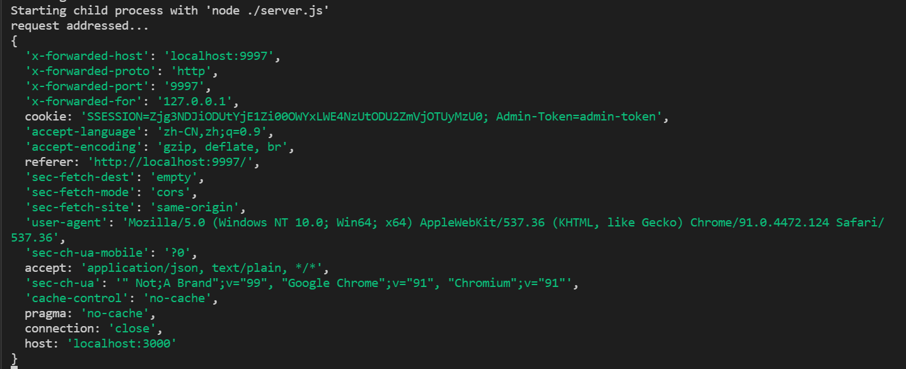

# 笔记

## 2021 年 10 月 1 日

### ref、reactive（10.28 补）

composition API 下定义基本数据类型和对象的方式...

```javascript
const userName = ref("张三")
console.log(username.value)

const listData = reactive([
  { id: 1, content: "123" },
  { id: 2, content: "234" }
])
console.log(listData)
```

em...用着是真的有点麻烦：

- `ref` 定义变量要通过 `.value` 来访问值（但通过 `return` 返回的会自动浅解包）
- 打印 `reactive` 对象到控制台的样子挺怪的，不直观



## 2021 年 10 月 2 日

### vue2 vs vue3 周期函数（11.4 补）

新增：

- beforeUnmount：在卸载组件实例之前调用。在这个阶段，实例仍然是完全正常的。
- unmounted：卸载组件实例后调用。调用此钩子时，组件实例的所有指令都被解除绑定，所有事件侦听器都被移除，所有子组件实例被卸载。
- renderTracked：跟踪虚拟 `DOM` 重新渲染时调用。钩子接收 `debugger event` 作为参数。此事件告诉你哪个操作跟踪了组件以及该操作的目标对象和键。
- renderTriggered：当虚拟 `DOM` 重新渲染被触发时调用。和 `renderTracked` 类似，接收 `debugger event` 作为参数。此事件告诉你是什么操作触发了重新渲染，以及该操作的目标对象和键。

删除：

- beforeDestory
- destoryed

准确的说，应该是 `beforeDestory` 和 `destoryed` 改成了 `beforeUnmount` 和 `unmounted`，并且新增了两个钩子函数用于追踪数据的变化

注意在 `vue3` 的 `composition API` 中，是没有 `beforeCreate` 和 `create` 这两个钩子函数，只有 `setup`，并且 `composition API` 中是用 `onX` 来注册对应的钩子函数

## 2021 年 10 月 3 日

### 自定义指令（11.5 补）

`vue3` 相较于 `vue2`，在钩子函数上做了一些改动，为了更好的跟生命周期钩子函数保持一致；除此之外，参数中 `expression`（字符串形式的指令表达式如：'`1+1`'） 将不在使用

（幸好常用的几个钩子变化不大 🤣）

`vue3` 指令钩子函数：

- `created` - 新增！在元素的 attribute 或事件监听器被应用之前调用。
- `bind` → `beforeMount`
- `inserted` → `mounted`
- `beforeUpdate`：新增！在元素本身被更新之前调用，与组件的生命周期钩子十分相似。
- `update` → 移除！该钩子与 updated 有太多相似之处，因此它是多余的。请改用 updated。
- `componentUpdated` → `updated`
- `beforeUnmount`：新增！与组件的生命周期钩子类似，它将在元素被卸载之前调用。
- `unbind` -> `unmounted`

## 2021 年 10 月 4 日

## Devtools Beta（11.15 补）

如果发现自己的 `vue3` 项目不能使用 `Devtools` 了，试试安装一下 `beta` 版的开发者工具吧

下载地址：[点这里 🚀](https://chrome.zzzmh.cn/info?token=ljjemllljcmogpfapbkkighbhhppjdbg)

## 2021 年 10 月 5 日

缺席...

## 2021 年 10 月 6 日

缺席...

## 2021 年 10 月 7 日

缺席...

## 2021 年 10 月 8 日

缺席...

## 2021 年 10 月 9 日

缺席...

## 2021 年 10 月 10 日

缺席...

## 2021 年 10 月 11 日

### changeOrigin

`proxy` 代理的选项之一，默认值为 `false`，会保留主机头的来源。即后端获取到接口请求头中的 `host` 值即为 `devServer` 下 `host` 的值



若设置为 `true`，则 `host` 值为 `proxy` 下 `target` 的值



因此（<span style="color: rgb(192, 52, 29)">**猜测**</span>）可以设置 `changeOrigin` 为 `true`，绕过后端的 `host` 检查

## 2021 年 10 月 12 日

### Git Hook

在提交代码到 `gitlab` 时，增加一层 `hook` 限制

`vue-cli` 创建的项目会自动安装 `yorkie`（`fork` 自 `husky`，但与后者不兼容）搭配 `lint-staged` 即可实现在 `git add` 时先 `run lint`（<span style="font-size:10px;color: rgb(192, 52, 29)">妈妈再也不用担心代码给人搞乱了</span> 😎）

```json
{
  "gitHooks": {
    "pre-commit": "lint-staged"
  },
  "lint-staged": {
    "*.{js,vue}": ["vue-cli-service lint", "git add"]
  }
}
```

注意：`lint-staged` 需要 `node12.13.0+` 的版本才能正常使用

## 2021 年 10 月 13 日

缺席...

## 2021 年 10 月 14 日

缺席...

## 2021 年 10 月 15 日

### .env 环境变量文件

主要有`.env`、`.env.[env]`、`.env.[env].local` 三种类型文件（`[env]` 指各种环境），优先级从左到右递增，其中 `.env.[env].local` 只在本地生效并且一般不提交到 `gitlab`，常用于多人合作开发时部署自己的联调环境

环境变量文件中，只有 `NODE_ENV`, `BASE_URL` 和以 `VUE_APP_` 开头的变量能通过 webpack.DefinePlugin 静态地嵌入到代码中

## 2021 年 10 月 16 日

缺席...

## 2021 年 10 月 17 日

缺席...

## 2021 年 10 月 18 日

\------------------------------------------------------

大致过完一遍 vue-cli4 官方文档...  
稍微熟悉了其中的配置...  
但手写 chainWebpack 还是有点困难...  
常用的插件也暂时没看...  
留着过 webpack 的时候再看吧...  
这个月好像断档的有点多...  
得努力了...  
hope...
祈っている...
🙏🙏🙏

## 2021 年 10 月 19 日

### 从 0 开始搞 webpack

需要选定一个入口文件作为内部依赖关系图的“开始”，默认输入路径为 `/dist`；所有需要使用到的文件都需要在入口文件中引用

各种常见类型文件对应处理 loader：

| 文件类型                     | 对应 loader               |
| ---------------------------- | ------------------------- |
| js                           | default                   |
| css                          | style-loader、css-loader  |
| scss                         | node-sass、sass-loader    |
| less                         | less-loader               |
| png \| jpg \| gif \| svg     | file-loader \| url-loader |
| ttf \| woff(2) \| otf \| eot | file-loader               |

- 处理 `css` 的 `loader` 顺序为：`css-loader` -> `style-loader`
- 处理 `scss` 文件需要使用 `sass-loader`，前提是需要安装 `node-sass` 依赖
- 若要将小 `icon` 转换成 `base64`，需要用到 `url-loader`
- `url-loader` 和 `file-loader` 只需要使用其中一个即可处理图片文件

### html-webpack-plugin

默认情况下 htmlwebpackplugin 会自动生成一个 HTML 文件，也可以自定义选定 template 文件

```javascript
plugins: {
  new htmlwebpackplugin({
    title: "测试title",
    filename: "index.html",
    template: path.resolve(__dianame, "realpath/template.html")
  })
}
```

指定 `template` 文件后，`htmlwebpackplugin` 会自动注入相关的 css、js 文件等

如上，指定 `template` 且设置了 title 参数后，如果 `template` 文件中已经设置了标题，那么 title 将不生效，需要通过 `<%= htmlWebpackPlugin.options.title %>` 获取到配置中的 title 参数

如果需要指定多入口文件：

需要 `new` 多几个 `htmlwebpackplugin` 对象，同时修改 `entry` 和 `output` 参数

- 更多相关 api 请查阅：[html-webpack-plugin 🚀](https://github.com/jantimon/html-webpack-plugin#options)

### clean-webpack-plugin

每次构建项目之前清理 /dist 文件夹

使用时需要注意：

```javascript
// webpack.config.js
// const CleanWebpackPlugin  = require('clean-webpack-plugin') 错误
const { CleanWebpackPlugin } = require('clean-webpack-plugin')

plugins: [
  new CleanWebpackPlugin()
],

```

**Otherwise**：可以借助 `node.js` 的 `file` 模块进行文件夹删除

**思考**：new CleanWebpackPlugin() 放置的位置会不会影响到最终的效果？

- 更多相关配置可查阅：[clean-webpack-plugin 🚀](https://github.com/johnagan/clean-webpack-plugin#usage)

## 2021 年 10 月 20 日

### source-map

将编译后的代码映射回源代码，用于开发环境

相关 source-map 类型及对应打包速度如下：

> `+++` 非常快速, `++` 快速, `+` 比较快, `o` 中等, `-` 比较慢, `--` 慢

| devtool                        | 构建速度 | 重构速度 | 生产环境 | 品质（quality）        |
| ------------------------------ | -------- | -------- | -------- | ---------------------- |
| none                           | +++      | +++      | yes      | 打包后的代码           |
| eval                           | +++      | +++      | no       | 生成后的代码           |
| cheap-eval-source-map          | +        | ++       | no       | 转换过的代码（仅限行） |
| cheap-module-eval-source-map   | o        | ++       | no       | 原始源代码（仅限行）   |
| eval-source-map                | --       | +        | no       | 原始源代码             |
| cheap-source-map               | +        | o        | yes      | 转换过的代码（仅限行） |
| cheap-module-source-map        | o        | -        | yes      | 原始源代码（仅限行）   |
| inline-cheap-source-map        | +        | o        | no       | 转换过的代码（仅限行） |
| inline-cheap-module-source-map | o        | -        | no       | 原始源代码（仅限行）   |
| source-map                     | --       | --       | yes      | 原始源代码             |
| inline-source-map              | --       | --       | no       | 原始源代码             |
| hidden-source-map              | --       | --       | yes      | 原始源代码             |
| nosources-source-map           | --       | --       | yes      | 无源代码内容           |

- 相关使用场景可参考：[devtool 🚀](https://v4.webpack.docschina.org/configuration/devtool#%E5%AF%B9%E4%BA%8E%E5%BC%80%E5%8F%91%E7%8E%AF%E5%A2%83)
- 相关测试效果用例：[source-map 🚀](https://github.com/webpack/webpack/tree/main/examples/source-map)

## 2021 年 10 月 21 日

### webpack 自动化编译

webpack 提供了以下三种自动化编译方案：

- webpack watch mode
- webpack-dev-server
- webpack-dev-middleware

#### webpack watch mode

```json
// package.json
{
  "script": {
    "watch": "webpack --watch"
  }
}
```

实现原理大致可以理解为：`webpack` 监控着项目（依赖图）中的所有文件，当文件发生改变时，自动重新编译代码，无需手动运行编译。

这种方法存在一个缺点，那就是每次重新编译，都需要手动刷新浏览器才会更新（`--watch` 会耗费较高的电脑性能吧？）

#### webpack-dev-server

安装 `webpack-dev-server` 依赖后即可跑项目（`webpack` 官网指南下的配置 `contentBase` 不可用~）

`webpack-dev-server` 在编译之后不会写入到任何输出文件，而是将 `bundle` 文件保留在内存中，然后将它们 `serve` 到 `server` 中，相当于部署在 `server` 的根路径下

相关原理内容较多，可参考以下链接：

- [devServer 配置 🚀](https://v4.webpack.docschina.org/configuration/dev-server/#devserver)
- [webpack-dev-server 运行原理 🚀](https://cloud.tencent.com/developer/article/1742015)

#### webpack-dev-middleware

`webpack-dev-middleware` 是一个封装器(`wrapper`)，它可以把 `webpack` 处理过的文件发送到一个 `server`。 `webpack-dev-server` 在内部使用了它，它也可以作为一个单独的 `package` 来使用，以便根据需求进行更多自定义设置。

官方文档地址：

- [webpack 自动化编译 🚀](https://v4.webpack.docschina.org/guides/development/#%E9%80%89%E6%8B%A9%E4%B8%80%E4%B8%AA%E5%BC%80%E5%8F%91%E5%B7%A5%E5%85%B7)

## 2021 年 10 月 22 日

### split-chunk-plugin

比较通用的性能优化方案之一，可提升重复构建打包速度及页面访问速度。常用属性及其配置如下：

```javascript
module.exports = {
  optimization: {
    splitChunk: {
      chunks: "all", // 打包的模块是按需引入、直接引入、还是全部都用于优化，对应的值为async initial all
      minSize: 30000, // 抽离公共包的最小size
      maxSize: 0, // 最大size
      minChunks: 1, // 某个模块至少被多少代码块引用，才会被提取成新的chunk
      maxAsyncRequests: 5, // 分割后，按需加载的代码块最多允许的并行请求数，在webpack5里默认值变为6
      maxInitialRequests: 3, // 分割后，入口代码块最多允许的并行请求数，在webpack5里默认值变为4
      automaticNameDelimiter: "~", // 用于生成的名称的分隔符
      automaticNameMaxLength: 30, // 生成的块的名称字符的最大值
      name: true, // 生成块的名称，为true时，将根据块和缓存组密钥自动生成名称
      cacheGroups: {
        // 将体积较大的包单独分离出来，减少vendor的体积，加快首屏速度
        vendors: {
          name: "chunk-vendors", // enforce默认为false下不能直接设置name值，否则打包会失败
          test: /[\\/]node_modules[\\/]/,
          priority: -10, // 表示缓存的优先级；
          reuseExistingChunk: true // 表示是否使用缓存
        }
      }
    }
  }
}
```

简单介绍其中的几个重要参数：

- `minSize`：当公共组件/包的大小超过 `minSize` 值时，才会抽离成单独的包
- `minChunks`：当某个组件/包的引用次数超过 `minChunks` 时，会抽离成单独的包
- `reuseExistingChunk`：当包未更改时是否直接使用之前的包

<!-- TODO: -->

**Warning**:

- minChunks 好像不生效？
- minSize 和 minChunks 同时触发时才会拆包还是触发其中一个条件即拆包？

## 2021 年 10 月 23 日

缺席...

## 2021 年 10 月 24 日

缺席...

## 2021 年 10 月 25 日

### 浏览器渲染

收录一些关键字段

- Chrome 浏览器，渲染引擎产生多个实例，对于每一个 tab 都是一个独立的过程（其他浏览器不同）
- 页面的渲染是一个渐进的过程，为了更好的用户体验，渲染引擎将尽可能在浏览器中显示内容，因此会提前解析部分内容和显示，剩下的内容从网络返回回来再继续解析（通过浏览器 `network` 面板下打开 `Capture screenshots`可看出）
- 词法分析是将输入信息切成小令牌(token)的过程。小令牌是语言词汇，即有效建筑模块的集合。
- 非可视化元素将不会插入到渲染树中。如 `head` 元素、`display：none` 的元素；但如 `opacity：0` 的元素还会插入

## 2021 年 10 月 26 日

### shim 预置依赖

- 当需要全局引入依赖的时候（虽然不推荐，但是真的香）如 lodash、jQuery
- 当需要对某些依赖进行 polyfill 时

以上能力都是基于 ProvidePlugin 实现

贴个文档地址吧：

- [shim 预置依赖 🚀](https://v4.webpack.docschina.org/guides/shimming/)
- [ProvidePlugin 🚀](https://v4.webpack.docschina.org/plugins/provide-plugin/)

### webpack 构建性能

webpack 官方提供的构建优化最佳实践：[构建性能 🚀](https://v4.webpack.docschina.org/guides/build-performance/)

## 2021 年 10 月 27 日

缺席...

## 2021 年 10 月 28 日

缺席...

## 2021 年 10 月 29 日

缺席...

## 2021 年 10 月 30 日

缺席...

## 2021 年 10 月 31 日

缺席...
