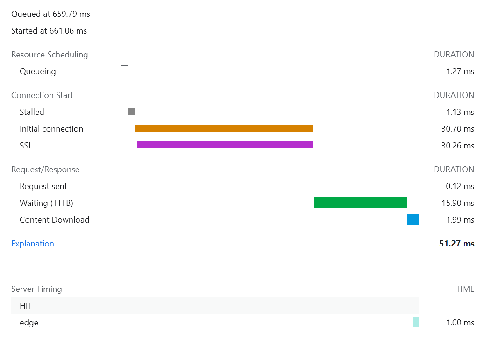
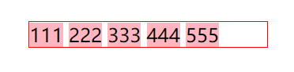

# 笔记

## 2021 年 11 月 1 日

### 快速删除 node_modules（1.12 补）

全局安装 `rimraf` 插件

```shell
cnpm install rimraf -g
```

然后输入下面一句命令即可：

```shell
rimraf node_modules
# 直接输入 node_modules 即可
```

## 2021 年 11 月 2 日

### Vscode 调试 Vue 项目（3.9 补）

基本流程可以从 `vue` 官网的 `Cookbook` 可以查到，这里记录一下需要注意的点：需要开启`source-map`

```javascript
export default {
  configureWebpack: config => {
    config.devtool = "source-map"
    return config
  }
}
```

参考地址：

- <https://cn.vuejs.org/v2/cookbook/debugging-in-vscode.html#%E4%BB%8E-VS-Code-%E5%90%AF%E5%8A%A8%E5%BA%94%E7%94%A8>
- <https://juejin.cn/post/7071219293249077256#heading-1>

## 2021 年 11 月 3 日

### 取消 watch 监听

`vue` 中的 `watch` 监听是可以取消的，使用方式如下：

```javascript
const someWatch = this.$watch("attr", () => {}, { options })
someWatch() // 取消监听
```

## 2021 年 11 月 4 日

### fixed 祖先

`position:fixed` 的元素会被移出正常文档流，并不为元素预留空间，而是通过指定元素相对于屏幕视口（`viewport`）的位置来指定元素位置。元素的位置在屏幕滚动时不会改变。`fixed` 属性会创建新的层叠上下文。当元素祖先的 `transform`, `perspective` 或 `filter` 属性非 `none` 时，容器由视口改为该祖先。

## 2021 年 11 月 5 日

### 对象动态赋值 ts 写法

```javascript
  searchData: ISearchData = {
    [propName: string]: any
  }
  this.searchData[someAttr as keyof ISearchData] = someValue as any
```

## 2021 年 11 月 6 日

缺席...

## 2021 年 11 月 7 日

缺席...

## 2021 年 11 月 8 日

### 首屏时间优化--视频

技术要点：

- 视频资源压缩（小丸工具箱，可移除音频）
- 视频资源格式转换为 `flv` 格式（借助 `B` 站开源的 `flv.js`）
- 其他非首屏资源延后加载

完整文档：[首屏视频的优化过程 🚀](https://segmentfault.com/a/1190000021578572)

### 首屏时间&白屏时间

- **白屏时间**：从页面打开到出现内容时的时间。浏览器只有加载并解析完头部资源才会真正渲染页面，因此可以通过获取头部资源加载完的时刻来近似（粗略）统计白屏时间

- **首屏时间**：首屏时间需要考虑各种情况如：图片、`iframe`、`video` 等。仅文本时，首屏时间即为 `DOMContentLoaded` 时间

#### performance API

重点关注 `performance API`，其中包含有：`memory`、`navigation`、`timeOrigin`、`timing` 四个属性。几乎都可以从这个 `API` 中拿到相关数值

分享个网上搜罗的好东西：

```javascript
// 出处：https://juejin.cn/post/6928739992986615816
window.onload = function() {
  var timing = performance.timing
  console.log("准备新页面时间耗时: " + timing.fetchStart - timing.navigationStart)
  console.log("redirect 重定向耗时: " + timing.redirectEnd - timing.redirectStart)
  console.log("Appcache 耗时: " + timing.domainLookupStart - timing.fetchStart)
  console.log("unload 前文档耗时: " + timing.unloadEventEnd - timing.unloadEventStart)
  console.log("DNS 查询耗时: " + timing.domainLookupEnd - timing.domainLookupStart)
  console.log("TCP连接耗时: " + timing.connectEnd - timing.connectStart)
  console.log("request请求耗时: " + timing.responseEnd - timing.requestStart)
  console.log("白屏时间: " + timing.responseStart - timing.navigationStart)
  console.log("请求完毕至DOM加载: " + timing.domInteractive - timing.responseEnd)
  console.log("解释dom树耗时: " + timing.domComplete - timing.domInteractive)
  console.log("从开始至load总耗时: " + timing.loadEventEnd - timing.navigationStart)
}
```

另外，获取首屏时间可以用 `performance.getEntries()` 获取 `first-contentful-paint` 的时间

#### 手打（网参）代码

白屏时间：

```html
<!-- 代码来源：https://fex.baidu.com/blog/2014/05/build-performance-monitor-in-7-days/ -->
<html>
  <head>
    <meta charset="UTF-8" />
    <script>
      //测试时间起点，实际统计起点为 DNS 查询，即navigationStart时间
      var start_time = +new Date()
    </script>
    <!-- 3s 后这个 js 才会返回 -->
    <script src="script.php"></script>
    <script>
      var end_time = +new Date() //时间终点
      var headtime = end_time - start_time //头部资源加载时间
      console.log(headtime)
    </script>
  </head>
  <body>
    <p>在头部资源加载完之前页面将是白屏</p>
    <p>script.php 被模拟设置 3s 后返回，head 底部内嵌 JS 等待前面 js 返回后才执行</p>
    <p>script.php 替换成一个执行长时间循环的 js 效果也一样</p>
  </body>
</html>
```

首屏时间：

```javascript
// 自己用的谷歌，没有那么严谨，不能直接用navigationStart作为开始时间哈
// 这里应该在head标签开始时插入一个获取时间戳的代码
let max = 0
let imgs = Array.from(document.getElementsByTagName("img")) // 获取所有的图片资源
imgs.forEach(tag => {
  tag.onload = function() {
    // 监听每一个图片的onload事件
    imgLoad(tag, tag.classList[0])
  }
})
function imgLoad(target, name) {
  // name没啥用，测试的时候拿来当名字用了
  target.dataset.time = new Date().getTime()
  console.log(name + "加载时间：" + (new Date().getTime() - performance.timing.navigationStart))
  let io = new IntersectionObserver(entries => {
    if (entries[0].intersectionRatio > 0) {
      // 过滤非首屏的图片
      max = Math.max(max, new Date().getTime())
      console.log(max)
    }
    io.unobserve(target)
  })
  io.observe(target)
}
```

<!-- TODO:  -->

疑问：

- video 视频是否会影响到首屏时间？

## 2021 年 11 月 9 日

### telepot

控制某个 `HTML` 模块（组件）挂载到指定的 `DOM` 下。使用方式如下，也可以通过 `id` 指定挂载的 `DOM`（`to="#target"`）。但需要注意，挂载的位置不会影响到原先的父子结构，即不会影响父组件的数据注入

如果有多个 `teleport` 挂载到同一个目标下，`teleport` 将会按照先后顺序插入到目标 `DOM` 下（感觉层级比较乱或出现问题的情况下会用的比较多吧，另外其实跟 `element ui` 的 `modal-append-to-body` 的效果差不多，不过 `teleport` 可以指定挂载的 `DOM`）

```HTML
<teleport to="body">
  <div>
      <h2>teleport</h2>
  </div>
</teleport>
```

## 2021 年 11 月 10 日

### 全局引入方式

#### 全局变量

`vue3` 中 `vue.property` 已被替换成 `config.globalProperties`。由于 `composition API` 中的 `this` 已经不是我们 `vue2` 中认识的 `this`，因此我们需要通过 `getCurrentInstance()` 方法来获取到当前实例

此时访问全局变量的方式则变成：

```javascript
// main.js
const app = createApp({})
app.config.globalProperties.$http = () => {}

// home.vue
setup() {
  const { $http } = getCurrentInstance().appContext.config.globalProperties
}

```

尽管作为 `vue.property` 的一种替代方案，但 `vue3` 官方文档仍建议用 `provide` 替代 `globalProperties`

```javascript
// main.js
app.provide('guide', 'Vue 3 Guide')

// home.vue
setup() {
  console.log(inject('guide'))
}
// Warning：inject() can only be used inside setup() or functional components.
```

#### 指令、组件、插件等

这里以 component 组件为例（其他类似）

```javascript
// /testComp/index.js
// install方法同vue2
import comp from "./index.vue"
export default {
  install: app => {
    app.component("testComp", comp)
  }
}

// main.js
// 需要use一下
import testComp from "./components/testComp"
const app = createApp(App)
app.use(testComp)
```

## 2021 年 11 月 11 日

### 我想不到系列之 -- 图片的优化

给图片加上 width、height 属性有利于 CLS（Cumulative Layout Shift 累积布局偏移）优化，通俗一点来说就是可以减少页面的重绘和回流

为什么可以减少页面重绘和回流？在设置了 width、height 属性之后，浏览器会根据图像的宽高属性设置图像的默认宽高比，因此开发者只要设置了宽高其中一个的数值时，浏览器便能计算出另外一个的数值

```html
<!-- 注意是不带单位的width、height值 -->

```

```css
/* 在谷歌img会多了这么一个默认属性： */
img[Attributes Style] {
  width: 313px;
  aspect-ratio: auto 313 / 428;
  height: 428px;
}
```

参考文档：[优化 Cumulative Layout Shift 累积布局偏移 🚀](https://web.dev/optimize-cls/?utm_source=lighthouse&utm_medium=devtools#images-without-dimensions)

## 2021 年 11 月 12 日

### Event Bus

`vue3` 中已废除 `$on`、`$off`、`$once` 实例方法，不能再像 `vue2` 一样使用。但 `vue3` 也提供了替换的方法：[mitt](https://github.com/developit/mitt)、[tiny-emitter](https://github.com/scottcorgan/tiny-emitter)

建议少用...

```javascript
// tiny-emitter使用如下：
import Emitter from "tiny-emitter"
const emitter = new Emitter()
// 绑定为全局可用或provide全局注入
app.config.globalProperties.emitter = emitter

// 触发与监听事件
// emitter.on('some-event', function (arg1, arg2, arg3) {})
// emitter.emit('some-event', 'arg1 value', 'arg2 value', 'arg3 value')
```

### $attrs、$listeners

`vue3` 中已经废除了 `$listeners`，在 `vue3` 的虚拟 `DOM` 中，事件监听器现在只是以 `on` 为前缀的 `attribute`，这样它就成为了 `$attrs` 对象的一部分，且可以通过 context.attrs[target] 访问

```html
<template>
  <label>
    <input type="text" v-bind="$attrs" />
  </label>
</template>
```

## 2021 年 11 月 13 日

### keep-alive

`vue` 缓存组件选项，常用于 `router-view` 或动态组件

```Vue
<keep-alive>
  <router-view />
</keep-alive>
```

`keep-alive` 还支持以下几个参数：

- `include` - 字符串或正则表达式，只有名称匹配的组件会被缓存
- `exclude` - 字符串或正则表达式，任何名称匹配的组件都不会被缓存
- `max` - 数字，最多可以缓存多少组件实例

`include/exclude` 匹配首先检查组件自身的 `name` 选项，如果 `name` 选项不可用，则匹配它的局部注册名称 (父组件 `components` 选项的键值)。匿名组件不能被匹配

Tips：`name` 对大小写敏感

## 2021 年 11 月 14 日

### vuex-commit

提交 `mutation` 方法：`commit(type: string, payload?: any, options?: Object)`，有三个可选参数：

- `type`：事件类型，即提交的 `mutation` 类型
- `payload`：载荷，也就是需要传递的参数
- `options`：包含一个选项：`root: true`，它允许在命名空间模块里提交根的 `mutation`

## 2021 年 11 月 15 日

缺席...

## 2021 年 11 月 16 日

缺席...

## 2021 年 11 月 17 日

缺席...

## 2021 年 11 月 18 日

### fs.stat(path[, options], callback)

获取指定路径的统计信息

`callback` 包含两个参数 `err`、`stats`，`stats` 即为统计信息，可以通过 `stats.isDirectory()` 判断是否为文件夹

不推荐在调用 `fs.open()`、`fs.readFile()` 或 `fs.writeFile()` 之前使用 `fs.stat()` 检查文件是否存在。 而是用户代码应该直接打开/读取/写入文件，并在文件不可用时处理引发的错误。

要检查文件是否存在而不对其进行操作，建议使用 `fs.access()`。

## 2021 年 11 月 19 日

缺席...

## 2021 年 11 月 20 日

缺席...

## 2021 年 11 月 21 日

### 获取依赖的版本号

通过 `package.json` 拿到版本号。一行代码搞定~

```javascript
const version = require("axios/package.json").version
```

## 2021 年 11 月 22 日

### vue-element-admin 在线换肤功能

主要逻辑为：获取当前 `element-ui` 版本，指定版本下载 `element-ui` 的样式文件，获取用户选择的颜色，重新计算各种 `ThemeCluster`、`ShadeColor` 等，利用正则将样式文件中的 `css` 替换成计算出来的结果

相关代码如下：

```javascript
if (!this.chalk) {
  // 如果样式文件不存在，则重新获取一份指定版本的css文件
  const url = `https://unpkg.com/element-ui@${version}/lib/theme-chalk/index.css`
  await this.getCSSString(url, "chalk")
}

const chalkHandler = getHandler("chalk", "chalk-style")

chalkHandler()

// oldVal 为旧的主题色，默认值为 ORIGINAL_THEME
const styles = [].slice.call(document.querySelectorAll("style")).filter(style => {
  const text = style.innerText
  return new RegExp(oldVal, "i").test(text) && !/Chalk Variables/.test(text)
})

styles.forEach(style => {
  const { innerText } = style
  if (typeof innerText !== "string") return
  style.innerText = this.updateStyle(innerText, originalCluster, themeCluster)
})
```

## 2021 年 11 月 23 日

### 禁止 input 自动补全

特别是账号密码输入框，不仅自动补全，还有丑的要命的背景色，看着就想干掉它。

相关方法测试情况：

- 如果直接使用：`autocomplete="off"`，兼容性也不太 ok （[查看兼容性](https://caniuse.com/?search=autocomplete)）
- 针对密码输入框使用：`autocomplete="new-password"`基本可以兼容
- 新增 `<input type="password" autocomplete="off" style="position:absolute;top:-9999px;opacity:0" />`，兼容性一半一半，部分浏览器（下表 × 部分）`input[text]` 仍然会自动填充
- 新增 `<input type="password" autocomplete="new-password" style="position:absolute;top:-9999px;opacity:0" />`基本可以兼容（注意 `element-ui` 下需要放在 `el-form` 下才会生效）

|                                         | 谷歌 | 火狐 | edge | opera |
| --------------------------------------- | ---- | ---- | ---- | ----- |
| autocomplete=off                        | ×    | √    | ×    | ×     |
| autocomplete=new-password               | √    | √    | √    | √     |
| 新增空白 input[password]                | ×    | √    | ×    | ×     |
| 新增空白 input[password] + new-password | √    | √    | √    | √     |

`千万别手下留情，淦它`

如果只是想干掉背景色，可以看[这里](https://real102.github.io/Blog/ugly/2021.10.html#%E8%BE%93%E5%85%A5%E6%A1%86%E8%87%AA%E5%8A%A8%E5%A1%AB%E5%85%85%E6%A0%B7%E5%BC%8F%E4%BC%98%E5%8C%96-11-23-%E8%A1%A5)

## 2021 年 11 月 24 日

### 内网穿透工具 frp（12.27 补）

需要配置两个端：服务端 `frps` 和客户端 `frpc`。

服务端 `frps` 通常部署在具有公网 `IP` 的机器上（云服务器），客户端则部署在需要穿透的机器上。映射的是本地 `localhost`。用户通过访问服务端 `frps`，由 `frp` 根据端口转发到对应的内网机器，从而实现通信

文档地址：<https://gofrp.org/docs/examples/ssh/>

其他穿透工具：`NATAPP`。

两者相比较下，`frp` 的优势在于可以自定义转发的端口，而 `NATAPP` 则是自动生成 `IP` + 端口，并且有并行连接数上限（好像是 `5` 个）

## 2021 年 11 月 25 日

### splitChunks 小 tips

在提取公共 chunk 时，主要利用的就是一下的两个配置项：

`minChunks`：包的最小引用次数  
`minSize`：包的最小体积

~~但实际上模块只有同时满足以上两个条件才会被提取到一个单独的 `chunk` 中去~~  
切割代码块与否跟 `chunks` 配置有关

## 2021 年 11 月 26 日

### provide this（1 月 2 日补）

源自 `element-ui` 的代码：`ElBreadcrumb`，将父组件的 `this` 通过 `provide` 注入到子孙组件，子孙组件再通过该 `this` 获取父组件的内容

疑问：不可以通过 `this.$parent` 来访问父组件吗？

```javascript
provide() {
  return {
    elBreadcrumb: this
  };
},
```

```javascript
inject: ['elBreadcrumb'],
mounted() {
  this.separator = this.elBreadcrumb.separator;
  this.separatorClass = this.elBreadcrumb.separatorClass;
}
```

## 2021 年 11 月 27 日

### Network - Timing 面板（1.6 补）

浏览器开发者工具的网络面板，点击任意一个网络请求，可以在右侧看到 `Timing` 时序面板，以下为时序面板各项的描述



- `Queueing`：浏览器在以下情况下对请求进行排队：更高优先级请求；已为此源打开六个 `TCP` 连接（仅适用于 `HTTP/1.0` 和 `HTTP/1.1`）；浏览器在磁盘缓存中短暂分配空间
- `Stalled`：请求可能因排队中描述的任何原因而停止。
- `DNS Lookup`：浏览器正在解析请求的 `IP` 地址。
- `Initial connection`：浏览器正在建立连接，包括 `TCP` 握手/重试和协商 `SSL`。
- `Proxy negotiation`：浏览器正在与代理服务器协商请求。
- `Request sent`：正在发送请求。
- `ServiceWorker Preparation`：浏览器正在启动 `Service Worker`。
- `Request to ServiceWorker`：请求正在发送给服务工作者。
- `Waiting (TTFB - Time To First Byte)`：浏览器正在等待响应的第一个字节。此时间包括 `1` 次往返延迟和服务器准备响应所用的时间。
- `Content Download`：浏览器直接从网络或 `Service Worker` 接收响应。该值是阅读响应正文所花费的总时间。大于预期的值可能表示网络速度较慢，或者浏览器正忙于执行其他工作，从而延迟了响应的读取。
- `Receiving Push`：浏览器正在通过 `HTTP/2` 服务器推送接收此响应的数据。
- `Reading Push`：浏览器正在读取之前接收到的本地数据。

文档地址：<https://developer.chrome.com/docs/devtools/network/reference/#timing-explanation>

## 2021 年 11 月 28 日

### inline

认识一下 `inline` 的庐山真面目

如果给 `HTML` 标签增加 `display: inline` 属性，会发现块级标签变成了行内标签，而行内标签则保持原样，并且都 “失去” 了宽和高，似乎变成了真正的行内标签。这种情况会出现在除了 `img`、`video` 外的其他标签（暂时知道的，可能会有其他）

`display: inline` 还会受到 [vertical-align 🚀](https://developer.mozilla.org/zh-CN/docs/Web/CSS/vertical-align) 的影响（内联元素的对齐方式由属性 `vertical-align` 决定），默认会以 `baseline`（父元素基线）展示。当父元素有一定高度，并且包含图片和文字两种形式的时候，会发现两者是没有对齐的，也就是 `vertical-align` 的默认值导致，因此需要自己手动来调整

因此，在使用 `inline` 属性的时候需要多加小心，避免踩雷：

- `inline` 属性会导致宽高失效
- `inline` 属性会受到 `vertical-align：baseline` 的影响
- 注意文本是否已经对齐

### inline-block

认识一下 `inline-block` 黑纱下的面容

现有以下这么一个 `HTML` 结构，如果给所有 `span` 标签加上 `inline-block` 属性后，应该都知道会出现这样的情况：`span` 都排列在一行，并且每个 `span` 之间有个间隔

这是由**空白符**导致，比如：空格(U+0020)、制表符(U+0009)、换行(U+000A)、回车(U+000D)、换页(U+000C)等在文档中，产生的表现形式即为空白符

```html
<div>
  <span>111</span>
  <span>222</span>
  <span>333</span>
  <span>444</span>
  <span>555</span>
</div>
```

展现效果如下：



常见的解决方案有：

1. 设置父元素的 `font-size` 为 `0`，可以达到消除间隙的效果，但需要对每一个内联元素设置 `font-size`
2. 消除内联标签之间的换行符、空格符等（但代码会变得很不美观，不太建议...）
3. 其他使用 letter-spacing 或 word-spacing 的感觉不太 ok

参考文档地址：[https://github.com/XXHolic/blog/issues/13 🚀](https://github.com/XXHolic/blog/issues/13)

## 2021 年 11 月 29 日

### 认识高阶函数

`高阶函数`：是一个接收函数作为参数或将函数作为输出返回的函数。

通俗一点就是，将函数当输入或输出的函数...

可能听起来还是有点绕，不过平时我们也肯定或多或少用过高阶函数：

- `Array.prototype.map`
- `Array.prototype.filter`
- `Array.prototype.reduce`

```javascript
const array1 = [1, 2, 3, 4]
const reducer = (previousValue, currentValue) => previousValue + currentValue

console.log(array1.reduce(reducer))
// expected output: 10
```

## 2021 年 11 月 30 日

### 变量提升

`ES6` 新增了 `let` 和 `const` 命令，加上 `var` 总共三种定义变量的方式

其中 `var` 存在变量提升，也就是在定义变量前可以访问，且值为 `undefined`

```javascript
console.log(str) // undefined
var str = "string"
console.log(str) // string
```

而对于 `let` 和 `const` 命令，则没有变量提升。在定义变量前访问该变量会直接报错

> `ES6` 明确规定，如果区块中存在 `let` 和 `const` 命令，这个区块对这些命令声明的变量，从一开始就形成了封闭作用域。凡是在声明之前就使用这些变量，就会报错。

函数也有变量提升，并且**优先级是高于变量**。但需要注意函数不同的定义方式也会有区别

```javascript
console.log(getName) // ƒ getName() { console.log("getName") }
function getName() {
  console.log("getName")
}

console.log(getAge) // undefined
// 对象字面量方式定义函数，会将getAge先提升，初始化为undefined，
// 然后再执行function的赋值操作。所以这种函数的提升不会在最前面
var getAge = function() {
  console.log("getAge")
}
```
