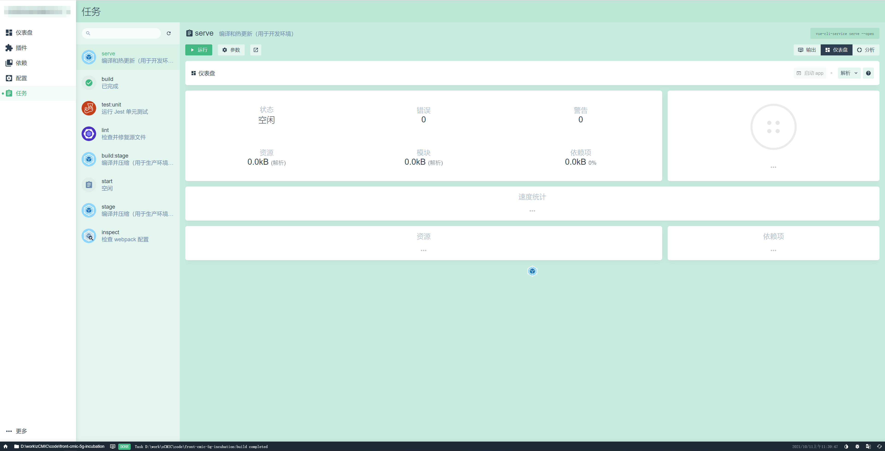

# 笔记

## 2021 年 9 月 1 日

### this.\$options

用于当前 Vue 实例的初始化选项，相当于实例的所有选项中的所有初始数据都保存了一个快照，包括 `data`、`methods` 等

小技巧：在表单提交页中，初始化表单数据，可以使用 `this.$options.data().formData` 获取到初始值再赋值

## 2021 年 9 月 2 日

### opener、referrer

`opener`：返回打开当前窗口的那个窗口的引用，默认需要设置为 `null`，否则有被获取原页面 `window` “控制权”的可能

`referrer`：返回一个 `URL`，代表当前页面是从这个 `URL` 页面跳转或打开的

Tips：
`HTML` 的 `referrer` 有以下几种策略：[no-referrer|no-referrer-when-downgrade|origin|origin-when-downgrade|strict-origin-when-cross-origin|unsafe-url 🚀](https://developer.mozilla.org/zh-CN/docs/Web/HTML/Element/a)

一般情况下，直接设置 `opener、referrer` 为 `null` 即可

## 2021 年 9 月 3 日

### storage 事件

对 `storage` 对象进行任何修改，都会在文档上触发 `storage` 事件，包括：`getItem`、`setItem`、`clear`、`delete`

`storage` 事件整体兼容性较好，但 `Safari` 浏览器较差，部分功能 `api` 完全不支持

[storage 兼容性 🚀](https://caniuse.com/?search=storage)

### progress

`filereader` 的 `progress` 事件约 `50ms` 触发一次

## 2021 年 9 月 4 日

### document.hidden

表示页面是否隐藏的属性，基本兼容主流浏览器（低版本除外）。当文档可见性发生改变时会触发 `visibilitychange` 事件（`Safari` 兼容性未知，需要加前缀）

使用时需要注意检测 `api` 的兼容性

例: 切换标签页时，更改原标签页的标题

[document.hidden 兼容性 🚀](https://caniuse.com/?search=document.hidden)  
[visibilitychange 兼容性 🚀](https://caniuse.com/?search=visibilitychange)

## 2021 年 9 月 5 日

## indexedDB

浏览器中保存结构化数据的一种数据库，操作完全是异步进行的，因此都需要注册事件监听（`onsuccess`、`onerror`）

`indexedDB` 的思想是创建一套 `api`，方便保存和读取 **`JavaScript` 对象**，同时还支持查询和搜索

兼容性：需要提供浏览器内核前缀 `indexedDB`| `msIndexedDB` | `webkitIndexedDB`| `mozIndexedDB`

## 2021 年 9 月 6 日

### 性能优化

1. 注意作用域：避免全局查找；避免 `with` 语句（会创建内部的作用域）
2. 选择正确的方法：避免不必要的属性查找；优化循环；展开循环；避免双重解释
3. 最小化语句数：多个变量声明；插入迭代值；使用数组和对象字面量
4. 优化 `DOM` 交互：最小化现场更新；使用 `innerHTML`；使用事件代理；最小化访问 `HTMLCollection`

### 时间复杂度 O

| 标记     | 名称 | 描述                                                           |
| -------- | ---- | -------------------------------------------------------------- |
| O(1)     | 常数 | 执行时间恒定，一般表示简单值和存储在变量中的值                 |
| O(n)     | 线性 | 与值的数量直接相关，例：遍历数组的所有元素                     |
| O(log n) | 对数 | 与值得数量相关，但是要完成算法不一定要获取每个值，例：二分查找 |
| O(n2)    | 指数 | 与值得数量相关，每个值至少执行 n 次，例：插入排序              |

1. 使用变量和数组比访问对象上的属性更高效，为 `O(n)`。（需要执行一次搜索，包括原型链）

## 2021 年 9 月 7 日

### Chrome debugger

1. 调试 `vue` 项目时，需要开启 `devtool：source-map`
2. 配置 `launch.json` 文件，参考如下
3. 打断点，启动项目

tips：若断点为灰色空心圆圈，需要检查一下 `source-map` 是否开启；若为红实心圆圈，则可以正常 `debug`

TODO: 其他调试方案？有没有更好玩的玩法？

```json
// 点击调试顶部工具栏的“齿轮”按钮会自动生成一串json，然后再修改为项目适用的配置即可
{
  "version": "0.2.0",
  "configurations": [
    {
      "type": "chrome",
      "request": "launch",
      "name": "运行当前项目",
      "url": "http://localhost:8080",
      "webRoot": "${workspaceFolder}/src",
      "breakOnLoad": true,
      "sourceMapPathOverrides": {
        "webpack:///src/*": "${webRoot}/*"
      }
    }
  ]
}
```

## 2021 年 9 月 8 日

### web Worker

- `worker` 消息内容可以是任何能被序列化的值
- `worker` 在不能完成既定的任务时会触发 `error` 事件，即在执行过程中遇到了任何错误都会触发 `error` 事件。包含三个属性：发生错误的文件名 `filename`、代码行号 `lineno`、完整的错误信息 `message`
- `worker` 内部的顶层对象是 `worker` 本身，而非 `window` 对象，并且 `worker` 内部不能对 `DOM` 执行任何操作
- `importScript('file1.js', 'file2.js')` 方法引入外部 js 文件，所有文件都是异步加载，并且是顺序执行

TODO: 应用场景：文件上传、加解密流程

```javascript
const worker = new Worker("worker.js")
worker.postMessage({ type: "des", message: "start" })
worker.terminate() // 立即停止worker的工作

// worker.js
self.onmessage = e => {
  const { data } = e
}

self.onerror = err => {
  console.log(err.filename + err.lineno + err.message)
}
```

### geolocation

- 获取用户的地理位置，用法暂时还没摸透...准确性也未知...
- 得到的数据是经纬度，这个方法貌似容易崩溃...
- 如果要用百度、高德、腾讯地图等显示出来，应该都需要进行坐标转换，然后才能够显示出来

```javascript
navigator.geolocation.getCurrentPosition(fnsuc, fnerr, {
  enableHighAccuracy: boolean,
  timeout: 5000,
  maximumAge: 25000
})

navigator.geolocation.watchPosition(fnsuc, fnerr)
navigator.geolocation.cleatWatch()
```

### js 红宝书第一遍结束（9.8）

大致花了一个月多时间大致完成阅读...  
附录部分略过了...  
太基础的也略过了...  
暂时接触不到的也略过了...  
准备开始 `vue.js` 官网 `2.x` 和 `3.x`...  
祈祷 ing...  
praying...  
祈っている...  
🙏🙏🙏

## 2021 年 9 月 9 日

### Object.freeze

冻结对象，禁止对象的任何修改。  
在 `vue` 中可以针对不希望被监听的对象进行“冻结”，特别是大量静态数据情况下，有助于性能的提升

## 2021 年 9 月 10 日

### Promise（12.23 补）

特点：

- 对象的状态不受外界的影响
- 一旦状态改变，就不会再变，任何时候都可以得到这个结果

缺点：

- 一旦创建就会立即执行，并且不能中途停止
- `Promise` 内部抛出的错误，必须设置 `catch` 回调函数才能捕获
- 当状态为 `Pending` 时，无法得知其当前的执行阶段，即不知道运行到哪了

状态：

- `pending`
- `fulfilled`
- `rejected`

注意：

- 调用 `resolve` 或 `reject` 并不会终结 `Promise` 的参数函数的执行，而是继续执行后面的**同步**代码，这是因为立即 `resolved` 的 `Promise` 是在本轮事件循环的末尾执行，总是晚于本轮循环的同步任务
- `Promise` 内部有语法错误时，浏览器运行时会报对应异常，但是不会退出进程，终止脚本执行。通俗的说法是 “[Promise 吃掉错误](https://es6.ruanyifeng.com/#docs/promise#Promise-prototype-catch) ”

<span style="color: #c0341d; font-size: 18px;">**ES2020**</span> 引入了一个新的方法：`Promise.allSettled()`，用来确定一组异步操作是否都结束了，不管 `resolve` 还是 `reject`

<span style="color: #c0341d; font-size: 18px;">**ES2021**</span> 引入了一个新的方法：`Promise.any()`，只要参数实例有一个变成 `fulfilled` 状态，包装实例就会变成 `fulfilled` 状态；如果所有参数实例都变成 `rejected` 状态，包装实例就会变成 `rejected` 状态。与 `promise.race()` 不同的是，不会因为某个实例 `reject` 而结束

## 2021 年 9 月 11 日

### web worker 处理文件上传时的思考（9.24 补）

上传文件时，使用 `web worker` 子线程处理二进制文件，可以通过下面的代码直接转移数据的控制权，不会造成性能负担

```javascript
// Transferable Objects 格式
worker.postMessage(arrayBuffer, [arrayBuffer])

// 例子
var ab = new ArrayBuffer(1)
worker.postMessage(ab, [ab])
```

计算文件 `hash` 值同样也可以移交至 `web worker` 执行

思考：

- 实际上文件上传使用的还是 `file` 类型文件，而不是 `ArrayBuffer`，这种情况下好像并不适用。如果是直接将 `file` 传给 `worker` 能否达到一样的效果？
- 文件切片完成后，不能一次性发起全部切片的上传请求，文件过大时会直接导致浏览器卡顿。可以考虑做一个上传队列，并且控制最大并发数

阮大大的教程：<https://www.ruanyifeng.com/blog/2018/07/web-worker.html>

## 2021 年 9 月 12 日

### delimiters（9.24 补）

vue 组件选项之一，这个选项只在完整构建版本中的浏览器内编译时可用。用于改变纯文本插入分隔符

```javascript
new Vue({
  delimiters: ["${", "}"]
})
```

## 2021 年 9 月 13 日

### ua 解析工具

1. mobile-detect
2. ua-parser-js

## 2021 年 9 月 14 日

### transition（9.26 补）

`vue` 内置的过渡组件，在整个动画过程中，具有多个钩子函数，在某一时刻触发。具体可参考 `vue` 文档

<https://cn.vuejs.org/v2/api/#transition>

### scroll-behavior（9.26 补）

切换路由时，页面的滚动行为。可以自动滚动到顶部、保持原先的位置或到指定的锚点等。但仅支持**history 模式** 和支持 `history.pushState` 的浏览器中可用。

```javascript
const router = new VueRouter({
  routes: [...],
  scrollBehavior (to, from, savedPosition) {
    // return 期望滚动到哪个的位置
    // 滚动到指定的锚点
     if (to.hash) {
      return {
        selector: to.hash,
        behavior: 'smooth'  // 支持的浏览器下可设置平滑滚动
      }
    }
    // 或滚动到原先的位置
    if (savedPosition) {
      return savedPosition
    } else {
      return { x: 0, y: 0 }
    }
    // 返回一个promise异步滚动
    return new Promise((resolve, reject) => {
      setTimeout(() => {
        resolve({ x: 0, y: 0 })
      }, 500)
    })
    //
  }
})
```

## 2021 年 9 月 15 日

### Prop

```html
<custom-input :inputValue="inputValue" class="custom-class"></custom-input>
```

如上代码所示，我们除了给组件绑定 `prop`（`inputValue`）属性外，还可以指定非 `prop` 的属性，例：`class` 属性。这个 `class` 属性最终会自动添加到 `custom-input` 组件内部的根元素上，并且某些属性值会与原先的值合并起来

可以通过设置 `inheritAttrs: false` 来禁用属性继承，并且借助 `$attrs` 来自定义设置所需要的继承属性

> 注意 `inheritAttrs: false` 选项不会影响 `style` 和 `class` 的绑定

<!-- TODO: -->

> 思考：vue3 的每个组件实例中已允许多个根元素，此时应该如何继承？

## 2021 年 9 月 16 日

### this.\$slots

## 2021 年 9 月 17 日

### intersectionObserver（10.10 补）

`IntersectionObserver` 浏览器原生提供的构造函数，用于 “观察” 某元素是否可见。构造函数返回一个 `observer` 实例，可以指定观察哪一个 `DOM` 节点

`IntersectionObserver` 可同时监听多个 `DOM` 节点，浏览器会自动创建多个 `IntersectionObserverEntry` 对象（`entries`），对应的是每个 `DOM` 节点的相关信息，其中比较常用的属性有： `target`（被观察的目标）、 `intersectionRatio`（目标可见比例）、 `isIntersecting`（目标是否在可视区域）

```javascript
let intersectionObserver = new IntersectionObserver(entries => {
  entries.forEach(ob => {
    if (ob.isIntersecting) {
      // 当目标可见时触发
      // do something...
      // 取消监听
      intersectionObserver.unobserve(ob.target)
    } else {
      // 当目标不可见时触发
      // do something...
    }
  })
})

// 开启监听，
intersectionObserver.observe($el)
```

## 2021 年 9 月 18 日

### 代码换行模式 LF、CRLF

`git` 在 `push` 代码时，会自动将 `CRLF` 格式转换成 `LF` 格式，而 `pull` 代码时，会自动将 `LF` 格式转换成 `CRLF` 格式

可通过以下配置解决

```bash
git config --global core.autocrlf false
git config --global core.safecrlf true
git config --global core.filemode false
```

扩展：

- `window` 的换行格式为：`CRLF`
- `Linux` 换行格式为：`LF`
- `Mac` 换行格式为：`CR`

## 2021 年 9 月 19 日

### JavaScript 与 scss 的数据交互

`scss` 可以通过 `:export` 导出到 `JavaScript`，只需要在 `JavaScript` 页面上引入它。其工作原理相当于 `ES6` 的 `export` 关键字

多的不说，学习去 😜

<https://www.bluematador.com/blog/how-to-share-variables-between-js-and-sass>

实用场景：

- 切换主题
- 动画

\----------------------------------------------------------------------------------------------------

9.29 补：

`scss` 可以通过 `:export` 导出变量，但好像并不能动态改变值，也就是说不能动态改变值...😅 感觉白开心了一场...

虽然不能动态改变，但可以用于 `element` 的自定义主题，具体方案可以参考 `element` 官网或者 `vue-element-admin` 项目

## 2021 年 9 月 20 日

### transpileDependencies（10.12 补）

默认情况下 `babel-loader` 会忽略所有 `node_modules` 中的文件。如果想要通过 `Babel` 显式转译一个依赖，可以在 `vue.config.js` 下的 `transpileDependencies` 属性中添加

若直接输入文件夹名不生效，可以考虑用正则代替，或者用 `npm` 重装一下依赖

```javascript
transpileDependencies: [
  'element-ui'
  /[/\\]node_modules[/\\](.+?)?element-ui(.*)[/\\]src/,
]
```

常用于 `ES` 语法兼容 `IE` 浏览器

如果需要显式地列出需要的 `polyfill`，可以使用 `@vue/babel-preset-app` 的 [polyfills](https://github.com/vuejs/vue-cli/tree/dev/packages/%40vue/babel-preset-app#polyfills) 选项预包含所需要的 `polyfill`

```javascript
// babel.config.js
module.exports = {
  presets: [
    [
      "@vue/app",
      {
        polyfills: ["es.promise", "es.symbol"]
      }
    ]
  ]
}
```

如果没有显式地列出需要的 `polyfill`，请使用 `useBuiltIns: 'entry'` 然后在入口文件添加 `import 'core-js/stable';` `import 'regenerator-runtime/runtime';`。这会根据 `browserslist` 目标导入所有 `polyfill`，但是因为包含了一些没有用到的 `polyfill` 所以最终的包大小可能会增加。

参考文档

- [vue-cli 文档](https://cli.vuejs.org/zh/guide/browser-compatibility.html#polyfill)
- [@babel/preset-env 文档](https://babeljs.io/docs/en/babel-preset-env.html#usebuiltins-usage)

## 2021 年 9 月 21 日

### 全局引用 scss（10.12 补）

若要在全局下引入 `scss` 变量文件，可以在 `vue.config.js` 中的 `css` 选项中增加配置，具体如下：

```javascript
module.exports = {
  css: {
    loaderOptions: {
      scss: {
        prependData: `@import "~@/styles/_vars.scss";`
      }
    }
  }
}
```

需要注意：

- `scss` 的参数不能用 `additionalData`，而是要用 `prependData`，否则会报错
- `sass-loader` 的版本应该大于 `7.0` （`7.0` 后更名为 `prependData`）

---

**补充**：`vite` 项目中全局引入代码如下：

```ts
module.exports = {
  css: {
    preprocessorOptions: {
      scss: {
        // 好像不能用 @/assets/*** 引入文件
        additionalData: '@import "./src/assets/css/_variable.scss";'
      }
    }
  }
}
```

参考文档：

- [vue-cli 文档](https://cli.vuejs.org/zh/guide/css.html#%E5%90%91%E9%A2%84%E5%A4%84%E7%90%86%E5%99%A8-loader-%E4%BC%A0%E9%80%92%E9%80%89%E9%A1%B9)
- [sass-loader 文档](https://github.com/webpack-contrib/sass-loader#additionaldata)

## 2021 年 9 月 22 日

### gitignore

使用.gitignore 文件忽略某些文件或文件夹的变化追踪，发现添加对应命令后仍然会被追踪，不妨试试将该文件或文件夹删除。

### errorHandler

```javascript
Vue.config.errorHandler = function(err, vm, info) {
  // handle error
  // `info` 是 Vue 特定的错误信息，比如错误所在的生命周期钩子
  // 只在 2.2.0+ 可用
}
```

`vue` 全局错误处理函数，建议持续关注：

> 从 2.2.0 起，这个钩子也会捕获<span style="color: #c0341d">组件生命周期钩子里的错误</span>。同样的，当这个钩子是 `undefined` 时，被捕获的错误会通过 `console.error` 输出而避免应用崩溃。  
> 从 2.4.0 起，这个钩子也会捕获 <span style="color: #c0341d">`Vue` 自定义事件处理函数内部的错误</span>了。  
> 从 2.6.0 起，这个钩子也会捕获 <span style="color: #c0341d">`v-on` `DOM` 监听器内部抛出的错误</span>。另外，如果任何被覆盖的钩子或处理函数返回一个 `Promise` 链 (例如 `async` 函数)，则来自其 <span style="color: #c0341d">`Promise` 链的错误也会被处理</span>。

注意：

`window.onerror` 会被 `errorHandler` 覆盖。如果仅需要捕获 `vue` 中的异常，请使用 `errorHandler`（[yyx](https://github.com/vuejs/vue/issues/5901#issuecomment-309106034)）

## 2021 年 9 月 23 日

### 页面崩溃监控

监控页面崩溃的思考：<https://zhuanlan.zhihu.com/p/40273861>

方法一：借助 `sessionstorage`，在 `document.load` 事件之后存储一个值为 `pending` 的 `good_exit` 参数，在用户正常退出页面时会触发 `beforeunload` 事件，同时将 `good_exit` 参数修改为 `true`。如果用户页面崩溃或非正常退出，那么 `good_exit` 仍会是 `pending`。这种方法的缺陷是，需要再次访问此页面的时候才能够判断页面是否崩溃“过”

方法二：借助 `web/service worker` 发起心跳包来检测页面是否卡顿或崩溃（`chrome://crash` 模拟崩溃好像不会触发）需要注意在正常退出页面时关闭 `web worker` 和定时器

## 2021 年 9 月 24 日

### propsData

只能用在 `new` 创建的实例中，创建实例时传递 `props`

可以简单理解为就是 `props`，只不过必须得用于 `vue.extend` 创建的子实例中

```javascript
var Comp = Vue.extend({
  props: ["msg"],
  template: "<div>{{ msg }}</div>"
})

var vm = new Comp({
  propsData: {
    msg: "hello"
  }
})
```

在写自定义插件的时候会有很大的用途，如：`toast` 插件

## 2021 年 9 月 25 日

### vue 项目管理器（10.11 补）

通过 `vue ui` 命令可以开启图形界面的项目管理器，多个项目之间灵活切换及跑各种 `npm` 命令，想偷懒的可以试试 😎



## 2021 年 9 月 26 日

### v-cloak

`v-cloak` 主要用于解决由于网络或其他原因导致页面来不及渲染而显示出源码的问题

如下所示，可能存在闪一下出现 `{{context}}` 再显示 "hello world" 的问题。主要在原生 `HTML` 项目中使用 `vue` 框架的情况下出现

```html
<div id="app">
  {{context}}
</div>
```

```vue
<script>
var app = new Vue({
  el: "#app",
  data: {
    context: "hello world"
  }
})
</script>
```

### keep-alive

- include：字符串、数组或正则表达式，只有名称匹配的组件会被缓存
- exclude：字符串、数组或正则表达式，任何名称匹配的组件都不会被缓存
- max：数字，最多可以缓存多少组件实例

`keep-alive` 下路由的跳转，页面会触发 `activated` 和 `deactivated` 事件

## 2021 年 9 月 27 日

### props 的妙用

当项目中需要用到链接栏传参时，经常会用到路由 `/path/:id?`

可以设置 `props:true` 即可跟父子传参一样用 `props` 接收链接栏的参数，即 `id`

```javascript
// router.js
const routes = [
  // ...
  {
    path: "/path/:id",
    component: () => import("@/views/**/path.vue"),
    props: true
  }
]

// path.vue
export default {
  props: {
    id: String
  }
}
```

## 2021 年 9 月 28 日

### router.replace

页面跳转除了用 `router.push()` 外，还可以使用 `router.replace()`，区别在于后者是直接替换历史记录

### router.resolve

router.resolve() 的功能是：返回一个完整的路径信息，可用于页面跳转

```javascript
const resolved: {
  location: Location;
  route: Route;
  href: string;
} = router.resolve(location, current?, append?)
```

## 2021 年 9 月 29 日

### scss 样式之 !default

`!default` 作用类似于缺省值，怎么用就看下面的例子吧，一看就懂

```scss
//Example1 Dress color = red
$auroras-dress-color: blue;
$auroras-dress-color: red;

//Example2 Dress color = red
$auroras-dress-color: blue !default;
$auroras-dress-color: red;

//Example3 Dress color = blue
$auroras-dress-color: blue;
$auroras-dress-color: red !default;
```

参考来源：[地址 🚀](https://stackoverflow.com/questions/10643107/what-does-default-in-a-css-property-value-mean)

## 2021 年 9 月 30 日

### mix() 函数

`scss` 下的一个函数，用于颜色的合并

```css
body {
  color: mix(#fff, #000, 50%);
}
```

如上所示，一般会有三个参数。第三个参数为权重，指第一个颜色所占的比例，默认为 `50%`

\----------------------------------------

vue2 官网好像也过完一遍了...  
遗留了些需要花时间熟悉的...  
下一步决定还是先搞一下 vue-cli 吧...
希望可以顺利...
但愿吧...  
hope...  
祈っている...  
🙏🙏🙏
