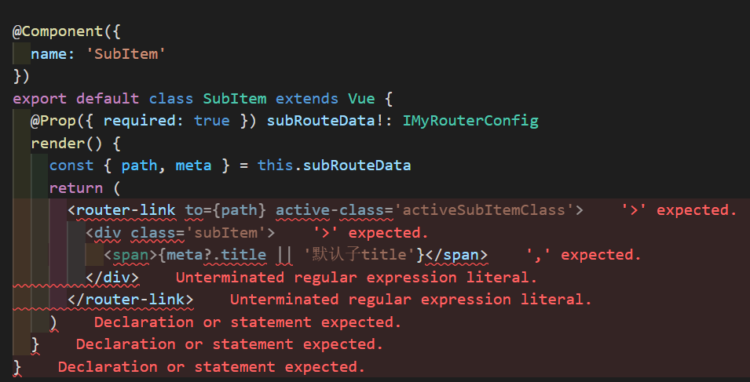

# 笔记

## 2022 年 2 月 1 日

### 类型断言

类型断言相当于告诉/指定 `TypeScript` 编译器某个值的类型

类型断言好比 `JS` 中的类型转换，但是不进行特殊的数据检查和解构。 它不会在运行时影响，只是在编译阶段起作用。

类型断言的两种方式：

```typescript
// “尖括号”语法
let someValue: any = "this is a string"
let strLength: number = (<string>someValue).length

// as语法
let someValue: any = "this is a string"
let strLength: number = (someValue as string).length
```

两种使用形式是等价的，但在 `TypeScript` 里使用 `JSX` 时，只有 `as` 语法断言是被允许的。

## 2022 年 2 月 2 日

### vuex-class 中使用 module

`vuex` 中使用 `module`，需要指定 `namespaced` 为 `true`

使用 `State` 访问 `module` 中的属性时，需要指定 `namespace`，有以下两种方式引用。前者适合需要多次使用同一个 `module` 的情况

```javascript
import { State, namespace } from "vuex-class"
const userModule = namespace("user")
export default class Home extends Vue {
  @userModule.State userInfo!: IUserInfo
}

// 或
import { State, namespace } from "vuex-class"
export default class Home extends Vue {
  @namespace('user').State userInfo!: IUserInfo
}
```

## 2022 年 2 月 3 日

### Computed Properties In Class-Component

使用 `vue-class-component` 后，已取消了 `computed` 选项，可以通过声明类属性 `getter/setter` 来代替

```javascript
import Vue from "vue"
import Component from "vue-class-component"

@Component
export default class HelloWorld extends Vue {
  firstName = "John"
  lastName = "Doe"

  // Declared as computed property getter
  get name() {
    return this.firstName + " " + this.lastName
  }

  // Declared as computed property setter
  set name(value) {
    const splitted = value.split(" ")
    this.firstName = splitted[0]
    this.lastName = splitted[1] || ""
  }
}
```

## 2022 年 2 月 4 日

### vue-class-component Hooks

使用了 `vue-class-component` 后，仍然可以正常使用 `vue` 选项，但不能在实例上调用它们，并且在声明方法时，避免使用这些保留名称

```javascript
import Vue from "vue"
import Component from "vue-class-component"

@Component
export default class HelloWorld extends Vue {
  // Declare mounted lifecycle hook
  mounted() {
    console.log("mounted")
  }

  // Declare render function
  render() {
    return <div>Hello World!</div>
  }
}
```

## 2022 年 2 月 5 日

### Additional Hooks

使用了 `vue-class-component` 后，如果需要使用如：`beforeRouterEnter` （`Vue Router` 插件） 等 `Vue` 插件提供的额外的方法的话，需要使用 `Component.registerHooks` 去注册这些钩子

```javascript
// class-component-hooks.js
import Component from "vue-class-component"

// Register the router hooks with their names
Component.registerHooks(["beforeRouteEnter", "beforeRouteLeave", "beforeRouteUpdate"])
```

注意在 `main.js` 中的引入位置

```javascript
// main.js
// Make sure to register before importing any components
import "./class-component-hooks"

import Vue from "vue"
import App from "./App"

new Vue({
  el: "#app",
  render: h => h(App)
})
```

之后，就可以正常使用相关方法了

## 2022 年 2 月 6 日

### 元素高度不固定时使用 transition 动画

一般情况下都会使用 `transition` 来实现元素的过渡效果，但如果遇到不固定长度元素的时候，设置 `height` 过渡是不会生效的，因为没办法获取到具体的数值。

这时候可以用 `max-height` 来实现效果

```html
<div class="div" :style="{ 'max-height': isExpand ? '250px' : '40px' }"></div>
```

```css
.div {
  transition: "max-height" 0.15s ease-in-out;
}
```

## 2022 年 2 月 21 日

### ES6 Class 的基本语法

`ES6` 的 `class` 可以看作是一个语法糖，它的绝大部分功能，`ES5` 都可以做到，新的 `class` 写法只是让对象原型的写法更加清晰、更像面向对象编程的语法。

下面的代码表明，类的数据类型就是函数，类本身就指向构造函数。

```javascript
class Point {
  // ...
}
typeof Point // "function"
Point === Point.prototype.constructor // true
```

- `this` 指向问题

类的方法内部如果含有 `this`，它默认指向**类的实例**。使用时需要注意，可能会报错

```javascript
class Logger {
  printName(name = "there") {
    this.print(`Hello ${name}`)
  }
  print(text) {
    console.log(text)
  }
}
const logger = new Logger()
const { printName } = logger
printName() // TypeError: Cannot read property 'print' of undefined
```

- 静态方法

类相当于实例的原型，所以在类中定义的方法，都会被实例继承。如果在方法前增加 `static` 关键字，就表示该方法不会被实例继承，需要通过类来调用

```javascript
class Foo {
  static classMethod() {
    return "hello"
  }
}

Foo.classMethod() // 'hello'

var foo = new Foo()
foo.classMethod()
// TypeError: foo.classMethod is not a function
```

如果是在静态方法里面调用 `this` 关键字，那么 `this` 指向这个类，而不是**实例**。另外，静态方法可以与非静态方法重名

- 私有属性的提案

目前有一个提案，为 `class` 添加私有属性。方法是在属性名之前，使用 `#` 表示

```javascript
class Foo {
  #a
  #b
  constructor(a, b) {
    this.#a = a
    this.#b = b
  }
  #sum() {
    return this.#a + this.#b
  }
  printSum() {
    console.log(this.#sum())
  }
}
```

## 2022 年 2 月 22 日

### JSX in vue-class-component

[vue-class-component](https://class-component.vuejs.org/guide/class-component.html#hooks) 官方文档上说明： `data, render and all Vue lifecycle hooks can be directly declared as class prototype methods as well`，但在实际使用时，发现 `render` 选项时会报错



目前发现可以通过以下几种方式调整：

1. `script lang="ts` 将 `lang=ts` 去掉后可以继续使用 `vue-class-component`
2. 取消使用 `vue-class-component`，改为用 `vue` 原生写法
3. 设置 `lang=jsx`，但这种情况下 `style` 会无效，并且 `vue` 的其他选项可能会受到影响

其他参考：

- [Stackoverflow](https://stackoverflow.com/questions/68403051/getting-vue-js-to-render-jsx-with-typescript-from-base-cli-install-with-jsx-pack?answertab=votes#tab-top)
- [Github](https://github.com/vuejs/vue-class-component/tree/master/example/src/components)
- [https://medium.com/@hayavuk/using-jsx-with-vue-js-and-typescript-d6963e44de48](https://medium.com/@hayavuk/using-jsx-with-vue-js-and-typescript-d6963e44de48)

## 2022 年 2 月 23 日

### type 与 interface 的异同

`type`（类型别名）和 `interface`（接口）非常相似，在很多情况下可以自由选择。接口的几乎所有特性在类型中都是可用的，主要有以下几点区别

- `interface` 可以 `extends`、`implement`，而 `type` 不允许。但是 `type` 可以通过交叉类型实现这两者的行为。`type` 可以与 `type`、`interface` 进行类型交叉

```javascript
interface IUser {
  name: string;
}

type person = IUser & {
  age: number
}
```

- `type` 可以声明基本类型别名，联合类型，元组等类型，而 `interface` 对值所具有的结构进行类型检查

```javascript
// 基本类型别名
type Name = string
// 联合类型
interface Dog {
    wong();
}
interface Cat {
    miao();
}
type Pet = Dog | Cat
// 具体定义数组每个位置的类型
type PetList = [Dog, Pet]
```

- `type` 不能重新打开以添加新属性，而 `interface` 总是可扩展的（关键区别）。例子如下：

```javascript
// Adding new fields to an existing interface
interface Window {
  title: string;
}
interface Window {
  ts: TypeScriptAPI;
}
const src = 'const a = "Hello World"'
window.ts.transpileModule(src, {})

// A type cannot be changed after being created
type Window = {
  title: string
}
type Window = {
  ts: TypeScriptAPI
}
// Error: Duplicate identifier 'Window'.
```

总的来说，一句话：能用 `interface` 用 `interface`，不能用就换 `type`

参考文档：

- [https://github.com/SunshowerC/blog/issues/7](https://github.com/SunshowerC/blog/issues/7)
- [typescriptlang.org](https://www.typescriptlang.org/docs/handbook/2/everyday-types.html#differences-between-type-aliases-and-interfaces)

## 2022 年 2 月 24 日

### 在 vue.config.js 中引入 ts 文件中的变量

TODO

## 2022 年 2 月 28 日

### ES6 Class 的继承

- `为什么子类的构造函数，一定要调用`super()`？

原因就在于 `ES6` 的继承机制，与 `ES5` 完全不同。`ES5` 的继承机制，是先创造一个独立的子类的实例对象，然后再将父类的方法添加到这个对象上面（原型链继承）。`ES6` 的继承机制，则是先将父类的属性和方法，加到一个空的对象上面，然后再将该对象作为子类的实例。这就是为什么 `ES6` 的继承必须先调用 `super()`方法，因为这一步会生成一个继承父类的 `this` 对象，没有这一步就无法继承父类。注意，这也意味着新建子类实例时，父类的构造函数必定会先运行一次。

- `super` 关键字

1. `super` 作为函数调用时，代表父类的构造函数。
2. `super` 作为对象时，在普通方法中，指向父类的原型对象；在静态方法中，指向父类。
3. 由于 `super` 指向父类的原型对象，所以定义在父类实例上的方法或属性，是无法通过 `super` 调用的。

```javascript
class A {
  constructor() {
    this.p = 2
  }
}
class B extends A {
  get m() {
    return super.p
  }
}
let b = new B()
b.m // undefined
```
