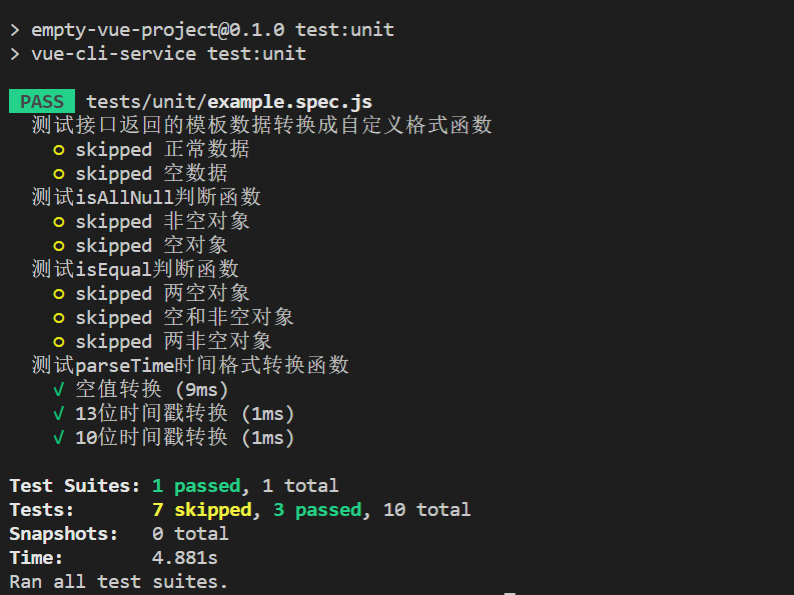

# 测试用例思考

## 需要考虑的测试点

- 测试组件渲染出来的 HTML 是否包含某部分 DOM `expect(wrapper.html()).toContain('<span class="count">0</span>')`

## 自己的想法

- 主要用来测边界情况？
- 常用来测试工具函数？

## 一些小技巧

### descript.each

`descript.each()` 常用于多组数据来测试同一组测试用例，用法如下：

```javascript
const addList = [
  { a: 1, b: 1, expected: 2 },
  { a: 1, b: 2, expected: 3 },
  { a: 2, b: 1, expected: 3 }
]
describe.each(addList)(".add($a, $b)", ({ a, b, expected }) => {
  test(`returns ${expected}`, () => {
    expect(a + b).toBe(expected)
  })

  test(`returned value not be greater than ${expected}`, () => {
    expect(a + b).not.toBeGreaterThan(expected)
  })

  test(`returned value not be less than ${expected}`, () => {
    expect(a + b).not.toBeLessThan(expected)
  })
})
```

### test.each

`test.each()` 可以将同一组的多个测试用例合并起来，看起来代码更加简介明朗，用法如下：

```javascript
const parseTimeList = [
  { stamp: 0, format: "{y}-{m}-{d} {h}:{i}:{s}", expected: null },
  { stamp: "1677465108767", format: "{y}-{m}-{d} {h}:{i}:{s}", expected: "2023-02-27 10:31:48" },
  { stamp: "1677465108", format: "{y}-{m}-{d} {h}:{i}:{s}", expected: "2023-02-27 10:31:48" }
]
describe("测试parseTime时间格式转换函数", () => {
  test.each(parseTimeList)("测试parseTime时间格式转换函数", ({ stamp, format, expected }) => {
    expect(parseTime(stamp, format)).toBe(expected)
  })
})
```

### .only

可以给 `descript` 和 `test` 增加 `.only` “修饰符”，这样在运行单元测试时，仅执行此类测试用例，参考如下：

```javascript
const parseTimeList = [
  { stamp: 0, format: "{y}-{m}-{d} {h}:{i}:{s}", expected: null },
  { stamp: "1677465108767", format: "{y}-{m}-{d} {h}:{i}:{s}", expected: "2023-02-27 10:31:48" },
  { stamp: "1677465108", format: "{y}-{m}-{d} {h}:{i}:{s}", expected: "2023-02-27 10:31:48" }
]
describe.only("测试parseTime时间格式转换函数", () => {
  test.each(parseTimeList)("测试parseTime时间格式转换函数", ({ stamp, format, expected }) => {
    expect(parseTime(stamp, format)).toBe(expected)
  })
})
```


